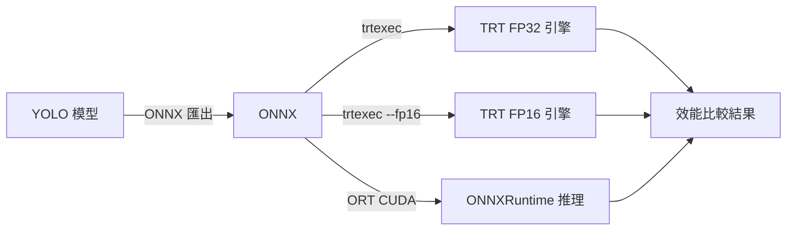

# TensorRT 知識圖譜

本書記錄 YOLO 分類模型從 ONNX 到 TensorRT 的完整推理優化知識，涵蓋架構概念、工作流程與效能評測。

## 專案目標

比較三種推理後端在 Windows + CUDA 12.8 環境下的延遲與吞吐量：

| 後端 | 說明 |
|------|------|
| ONNXRuntime GPU | 基準線，CUDAExecutionProvider |
| TensorRT FP32 | 全精度 TRT 引擎 |
| TensorRT FP16 | 半精度 TRT 引擎（主要優化目標）|

## 快速導覽

## 模型資訊

- **任務**: 影像分類（9 類：標籤 "1"–"9"）
- **輸入**: NCHW 格式，像素值 ÷ 255，無 letterbox
- **輸出**: logits（若 min < 0 或 sum ≠ 1 則套用 softmax）
