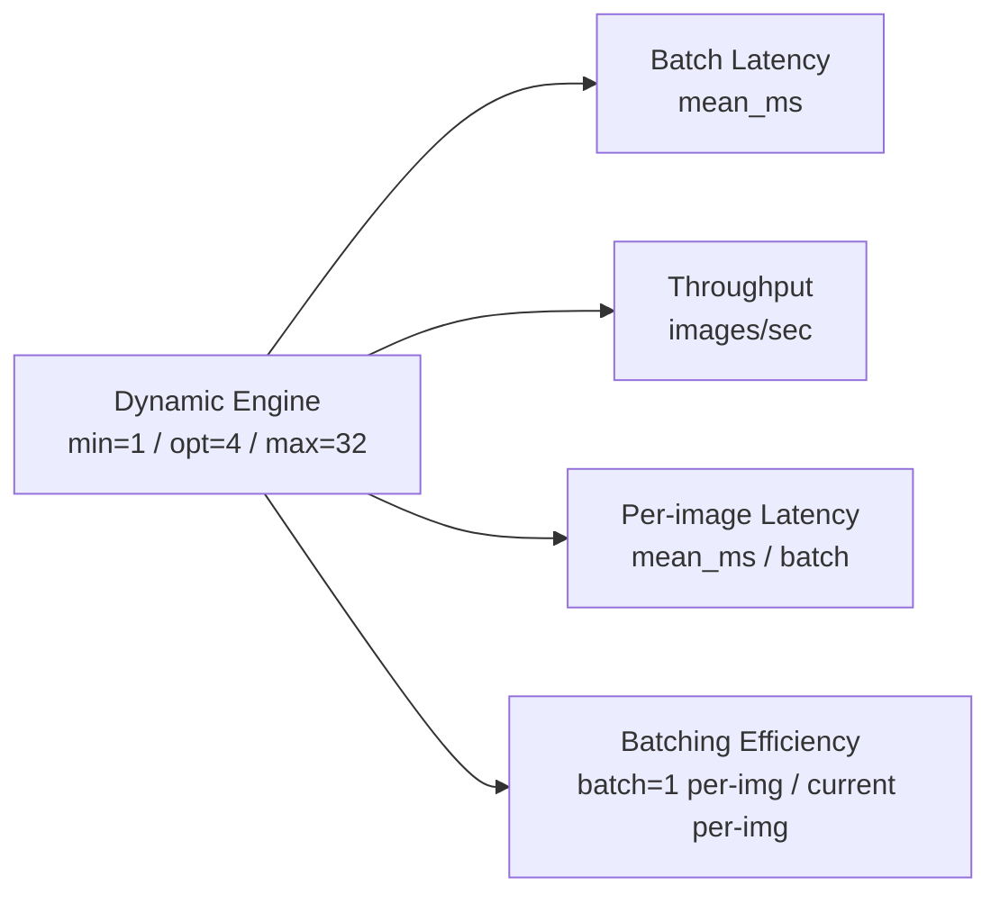
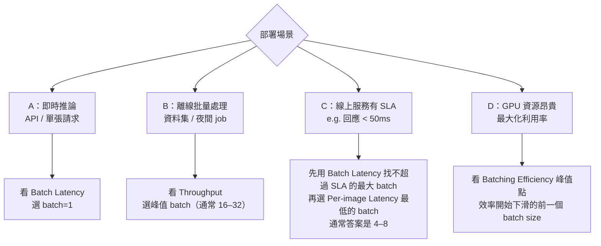
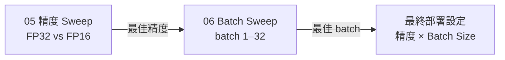

# Batch Size Sweep 調研

在精度（FP16/FP32）確定後，本頁說明如何透過 batch size sweep 找出最佳部署配置。

> **前置條件**：ONNX 必須先轉為動態 batch engine，見 [動態 Batch 工作流程](../workflow/dynamic-batch.md)。

## 為什麼需要 Sweep

同一個模型以不同 batch size 推論時，GPU 的並行利用率差異很大。  
batch=1 保證最低延遲，但 GPU 可能大量閒置；batch=32 填滿 GPU 算力，但單批延遲上升。  
Sweep 的目的就是量化這個取捨，讓部署決策有數據依據。

## 四個關鍵指標



| 指標 | 計算方式 | 意義 |
|------|---------|------|
| `mean_ms` | trtexec 直接輸出 | 一整批的端對端延遲 |
| `images/sec` | `throughput_qps × batch` | 每秒可處理幾張圖 |
| `per_image_ms` | `mean_ms / batch` | 批次化後每張圖平均耗時 |
| `efficiency` | `per_img(batch=1) / per_img(N)` | 相對於單張推論的效率倍率 |

## 四張圖各自回答什麼問題

### 1. Batch Latency

```
batch size → mean_ms
```

斜率平緩 → GPU 能吸收更多並行；陡升 → 記憶體或算力已達瓶頸。

### 2. Throughput（images/sec）

```
batch size → images/sec
```

找到峰值 batch。超過這點再加大 batch，吞吐不再增加，代表 GPU 飽和。

### 3. Per-image Latency

```
batch size → mean_ms / batch
```

曲線趨平的位置就是「邊際效益消失點」。在此之後繼續加大 batch，每張圖的平均時間幾乎不再下降。

### 4. Batching Efficiency

```
batch size → efficiency 倍率（1.0 = 與 batch=1 相同效率）
```

效率 > 1.0 代表批次化有效；到達峰值後下降代表過度批次，資源浪費在排程而非計算。

## 決策框架



## 與 Phase 1（精度 Sweep）的關係



05 選出最快的精度；06 在這個精度固定的前提下，再找最佳 batch size。  
兩者合在一起才是完整的 TensorRT 部署配置。

## 常見判讀誤區

| 誤區 | 正確理解 |
|------|---------|
| Throughput 最高 = 最好的配置 | 需先確認延遲是否在 SLA 內 |
| Efficiency 下降就該停止加大 batch | 離線場景可接受低 efficiency，只要 images/sec 還在上升 |
| opt shape 填 max | opt 應填**最常見的推論批次**，填 max 會讓小 batch 效能偏差 |
| per_image_ms 越低越好 | 低延遲場景應看 mean_ms，per_image_ms 是批次效益指標 |
