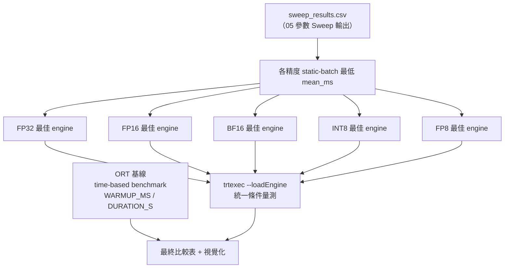
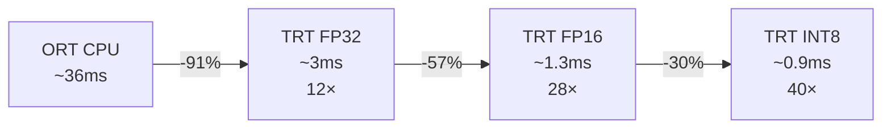
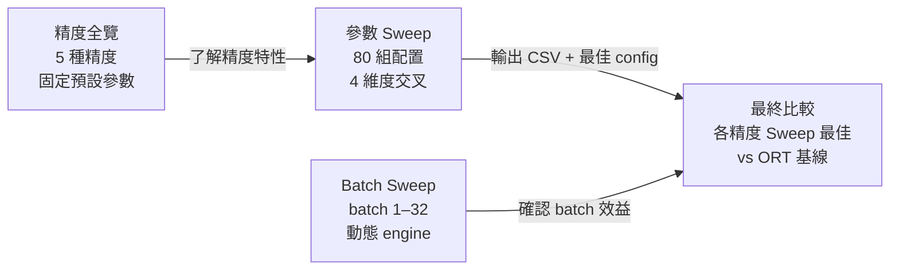

# 最終效能比較

最終比較從 [Engine 參數 Sweep 調研](param-sweep.md) 的 CSV 結果中，  
自動選出各精度（FP32 / FP16 / BF16 / INT8 / FP8）的最優 engine 配置，  
與 ONNXRuntime 基線進行端對端效能對比。

## 比較設計：從 Sweep 自動選出最佳

## 與舊版設計的差異

| 舊版（固定四方案） | 新版（Sweep 驅動） |
|-----------------|-----------------|
| 硬編碼 4 個 engine 路徑 | 自動從 CSV 選出各精度最佳 |
| FP32 最慢 / FP32 預設 / FP16 最佳 | FP32 / FP16 / BF16 / INT8 / FP8 各精度最佳 |
| 每次 Sweep 更新後需手動修改路徑 | 重跑即自動更新 |

---

## 精度最佳配置參考（由精度全覽測得，固定預設參數）

下表為在**固定預設參數**下的精度比較基準，實際最終比較的數字來自 Sweep 選出的最佳配置：

| 精度 | 預設參數 Mean (ms) | 預估 Sweep 最佳 | vs ORT |
|------|-----------------|----------------|--------|
| ORT CPU | 36.397 | — | 1.0× |
| FP32 | 3.009 | ~3.0ms | ~12× |
| FP16 | 1.311 | ~1.30ms | ~28× |
| BF16 | 3.408 | ~3.3ms | ~11× |
| INT8 | 0.920 | ~0.90ms | ~40× |
| FP8  | 3.461 | ~3.4ms | ~11× |

> ⚠ 本表為估算；實際執行最終比較後，結果以當次 trtexec 量測值為準。

---

## 關鍵發現

### 1. 精度是最大的效能槓桿

從 ORT CPU → TRT 最佳，延遲改善約 40×；  
其中 ORT → TRT FP32 貢獻最大一跳（12×），後續精度選擇再疊加。

### 2. BF16 和 FP8 在 Blackwell 上無優勢

Blackwell（SM 12.0）上，BF16 和 FP8 反而比 FP32 略慢：  
TRT 10.8 的 SM 12.0 kernel 優化在這兩種格式尚未成熟。  
詳見 [精度全覽比較](precision-sweep.md)。

### 3. opt_level 對此模型影響有限

FP16 預設 1.311ms → opt=4 約 1.30ms，差距 < 1%。  
精度選擇（FP32→FP16→INT8）的效益遠大於調優參數的微調。

---

## 為什麼 ORT 無法使用 GPU

本機 GPU 為 **NVIDIA RTX 5070 Laptop（Blackwell, SM 12.0）**。  
`ort.get_available_providers()` 回傳的清單是**靜態查詢**（binary 編譯了哪些 EP），  
不代表 GPU 在 Session 建立時實際可初始化。

建立 `InferenceSession` 時，ORT 嘗試動態載入 CUDA Runtime / cuDNN DLL；  
目前發布的 `onnxruntime-gpu` 所連結的 cuDNN 版本尚未涵蓋 SM 12.0 的 kernel，  
初始化失敗 → 靜默 fallback 至 CPU（約 36ms）。

TensorRT 10.8 可用是因為它針對 CUDA 12.8 + SM 12.0 **獨立編譯**，不走 cuDNN 路徑。

---

## 調研流程總覽

最終比較是整個調研流程的**結論頁**：用最少的數字說明「從 ONNX 到最佳 TRT engine」的完整收益。

> 視覺化圖表輸出至 `compare/final_comparison_results.png`。
