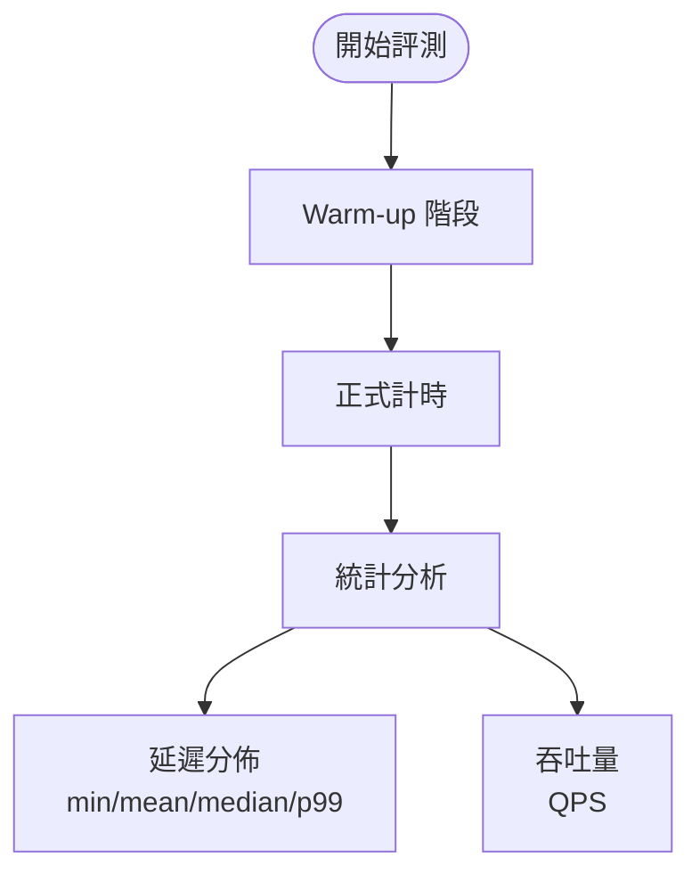

# 評測方法論

## 評測設計



## 評測對象

| 後端 | 工具 | 計時方式 |
|------|------|---------|
| TensorRT FP32 | trtexec | CUDA event（純 GPU 時間）|
| TensorRT FP16 | trtexec | CUDA event（純 GPU 時間）|
| ONNXRuntime GPU | Python 手動計時 | 包含 CPU-GPU 傳輸 |

## 計時方法差異

### trtexec
- 使用 CUDA event 計時，排除 CPU 開銷
- 自動 warm-up + 穩定期計時
- 報告 GPU 端到端延遲

### ORT 手動計時
```python
import time
times = []
for _ in range(300):
    t0 = time.perf_counter()
    session.run(output_names, {input_name: img})
    times.append(time.perf_counter() - t0)
```
- 包含 CPU ↔ GPU 資料傳輸
- 前 N 次視為 warm-up 排除

## 公平比較原則

1. **相同輸入**: 相同尺寸的隨機 tensor
2. **相同 batch size**: batch=1（單張推理場景）
3. **隔離執行**: 各後端獨立執行，避免相互干擾
4. **多次平均**: 消除單次測量噪聲
