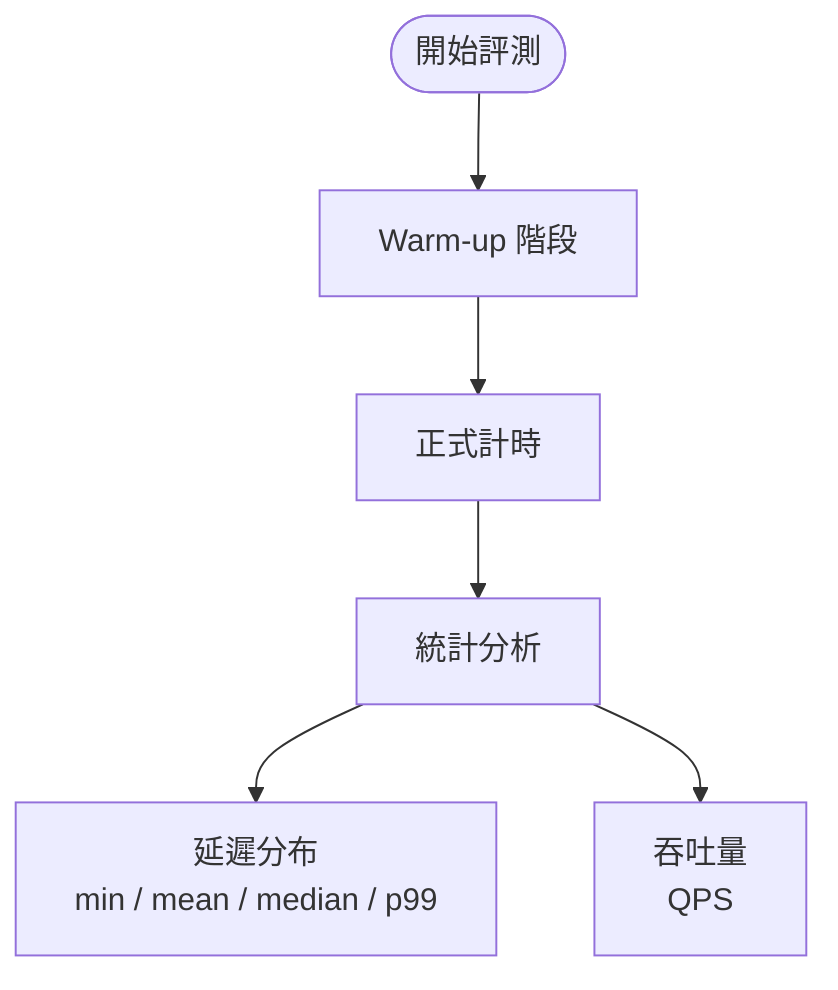
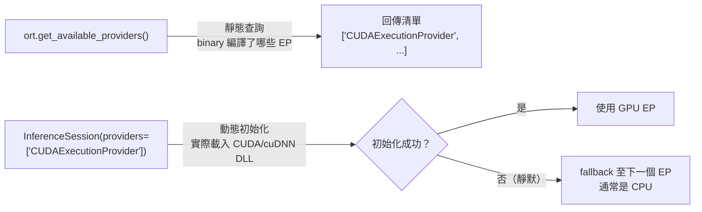

# 評測方法論

## 評測設計



## 評測對象

| 後端 | 工具 | 計時方式 |
|------|------|---------|
| TensorRT FP32 | trtexec | CUDA event（純 GPU 時間）|
| TensorRT FP16 | trtexec | CUDA event（純 GPU 時間）|
| ONNXRuntime | Python 手動計時 | 包含 CPU-GPU 傳輸（或純 CPU）|

## 計時方法差異

### trtexec

- 使用 CUDA event 計時，排除 CPU 開銷
- 自動 warm-up + 穩定期計時
- 報告 GPU 端到端延遲

### ORT 手動計時

```python
import time
times = []
for _ in range(300):
    t0 = time.perf_counter()
    session.run(output_names, {input_name: img})
    times.append(time.perf_counter() - t0)
```

- 包含 CPU ↔ GPU 資料傳輸（若 GPU EP 可用）
- 若 GPU EP 不可用則為純 CPU 時間
- 前 N 次視為 warm-up 排除

## ORT GPU EP 與 CPU Fallback

`onnxruntime` 的 EP（Execution Provider）有兩層概念：



**靜態清單存在 ≠ GPU 實際可用。**  
本機 GPU（RTX 5070 Laptop, SM 12.0 / Blackwell）由於 `onnxruntime-gpu` 所連結的  
cuDNN 版本尚未支援 SM 12.0 kernel，session 建立時 GPU EP 初始化失敗，靜默 fallback CPU。

TensorRT 10.8 可運行是因為它針對 CUDA 12.8 + SM 12.0 獨立編譯，不經 cuDNN 路徑。

> 四方案實測比較見 [四方案效能總比較](comparison.md)。

## 公平比較原則

1. **相同輸入**：相同尺寸的隨機 tensor
2. **相同 batch size**：batch=1（單張推理場景）
3. **隔離執行**：各後端獨立執行，避免相互干擾
4. **多次平均**：消除單次測量噪聲
