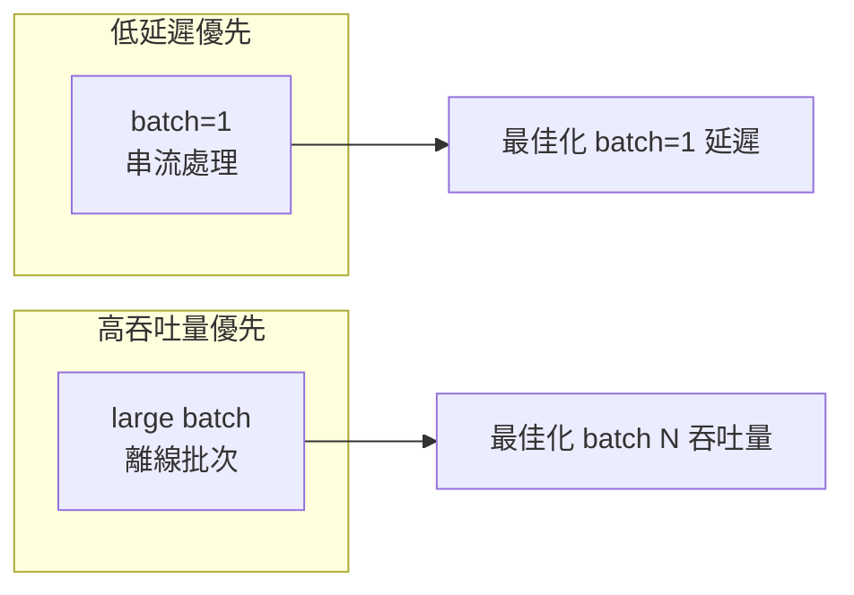

# 延遲與吞吐量

## 指標定義

### 延遲（Latency）
單張影像從輸入到輸出的時間，單位 **毫秒（ms）**。

| 指標 | 說明 | 適用場景 |
|------|------|---------|
| min | 最佳情況 | 理論上限 |
| mean | 平均值 | 一般效能評估 |
| median（P50） | 中位數 | 比 mean 更抗 outlier |
| P95 | 第 95 百分位 | 日常最差情況 |
| P99 | 第 99 百分位 | SLA 保證、即時系統 |

### 吞吐量（Throughput）
單位時間處理的影像數，單位 **QPS（Queries Per Second）**。

```
QPS = 1000 / mean_latency_ms
```

## 延遲與吞吐量的權衡



## Tail Latency（尾端延遲）

生產環境中 **P99 往往比 mean 高出 3–10×**，原因包括：

- GPU context switch / driver interrupt
- CUDA kernel 排程抖動（jitter）
- 記憶體分頁錯誤或 cache miss
- 系統背景負載（OS scheduler）


### 為什麼要看 P95/P99

若系統 SLA 要求 95% 請求在 5 ms 內完成，只看 mean（如 2 ms）會得出錯誤結論；
實際 P95 可能達 12 ms，導致 SLA 違規。

## 延遲分布分析

單純的 mean / median 無法捕捉分布形狀。Notebook Cell 6c 用 500 次取樣繪製：

| 圖表 | 目的 |
|------|------|
| **直方圖** | 看分布整體形狀、是否雙峰、長尾有多長 |
| **Box Plot** | 快速確認 Q1/Q3/IQR 與離群值範圍 |
| **Jitter Scatter** | 看單次樣本的隨機性（GPU 排程抖動）|

### 分布健康指標

```
P99 / mean  < 2   → 延遲穩定，可預測
P99 / mean  2–5   → 有抖動，需關注
P99 / mean  > 5   → 長尾嚴重，生產風險高
```

## trtexec 輸出範例

```
[I] === Performance summary ===
[I] Throughput: 2345.67 qps
[I] Latency: min = 0.389 ms, max = 0.612 ms, mean = 0.426 ms
[I]          median = 0.421 ms, percentile(90%) = 0.445 ms,
[I]          percentile(95%) = 0.458 ms, percentile(99%) = 0.501 ms
```

trtexec stdout 的效能指標可透過正規表達式提取，常見欄位為 `Throughput`、`mean`、`median`、`percentile(99%)` 等。

## Speedup 計算

Notebook Cell 7 以 ORT 基線（Cell 6 量測值）為分母計算各引擎加速比：

```
Speedup = baseline_mean_ms / engine_mean_ms
```

加速比 > 1 代表比基線快；TRT FP16 相對 ORT CPU 通常可達 **20–60×**（視模型複雜度）。
