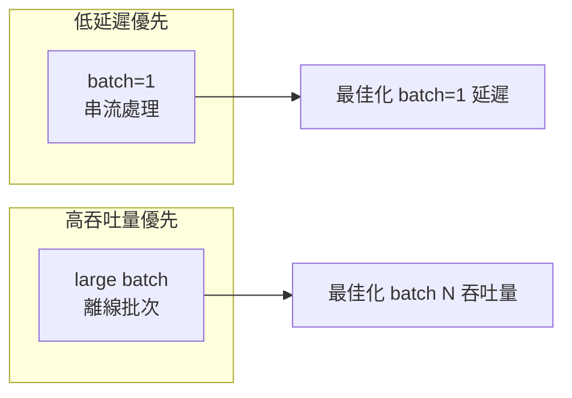

# 延遲與吞吐量

## 指標定義

### 延遲（Latency）
單張影像從輸入到輸出的時間，單位 **毫秒（ms）**。

| 指標 | 說明 | 適用場景 |
|------|------|---------|
| min | 最佳情況 | 理論上限 |
| mean | 平均值 | 一般效能評估 |
| median | 中位數 | 比 mean 更抗 outlier |
| p99 | 第 99 百分位 | SLA 保證、即時系統 |

### 吞吐量（Throughput）
單位時間處理的影像數，單位 **QPS（Queries Per Second）**。

```
QPS = 1000 / mean_latency_ms
```

## 延遲與吞吐量的權衡



## trtexec 輸出範例

```
[I] === Performance summary ===
[I] Throughput: 2345.67 qps
[I] Latency: min = 0.389 ms, max = 0.612 ms, mean = 0.426 ms
[I]          median = 0.421 ms, percentile(90%) = 0.445 ms,
[I]          percentile(95%) = 0.458 ms, percentile(99%) = 0.501 ms
```

trtexec stdout 的效能指標可透過正規表達式提取，常見欄位為 `Throughput`、`mean`、`median`、`percentile(99%)` 等。
