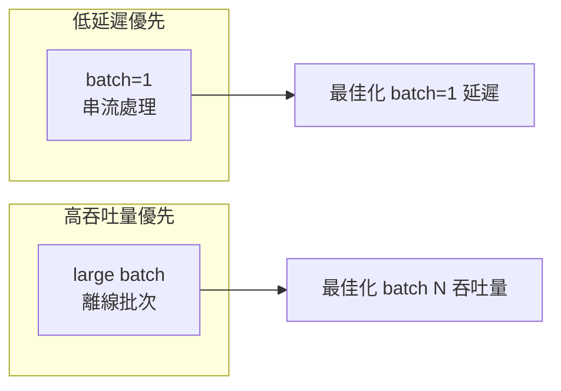
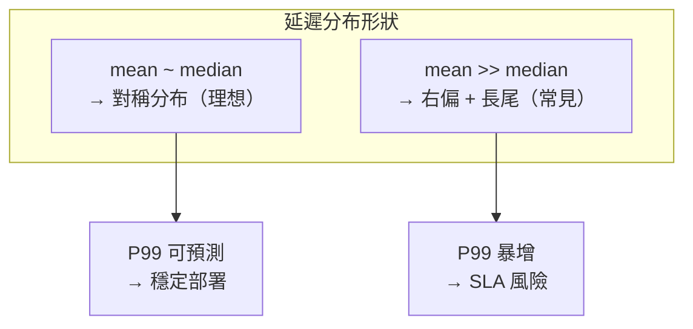

# 延遲與吞吐量

## 指標定義

### 延遲（Latency）

單張影像從輸入到輸出的時間，單位**毫秒（ms）**。

| 指標 | 說明 | 適用場景 |
|------|------|---------|
| min | 最佳情況 | 理論上限 |
| mean | 平均值 | 一般效能評估 |
| median（P50） | 中位數 | 比 mean 更抗 outlier |
| P95 | 第 95 百分位 | 日常最差情況 |
| P99 | 第 99 百分位 | SLA 保證、即時系統 |

### 吞吐量（Throughput）

單位時間處理的影像數，單位 **QPS（Queries Per Second）**。

```
QPS = 1000 / mean_latency_ms
```

## 延遲與吞吐量的權衡



## Tail Latency（尾端延遲）

生產環境中 **P99 往往比 mean 高出 2–5×**，原因包括：

- GPU context switch / driver interrupt
- CUDA kernel 排程抖動（jitter）
- 記憶體分頁錯誤或 cache miss
- 系統背景負載（OS scheduler）



### 為什麼要看 P95/P99

若系統 SLA 要求 95% 請求在 5ms 內完成，只看 mean（如 2ms）會得出錯誤結論；  
實際 P95 可能達 12ms，導致 SLA 違規。

## 延遲分布分析

單純的 mean / median 無法捕捉分布形狀，可透過多次取樣繪製：

| 圖表 | 目的 |
|------|------|
| **直方圖** | 看分布整體形狀、是否雙峰、長尾有多長 |
| **Box Plot** | 快速確認 Q1/Q3/IQR 與離群值範圍 |
| **Jitter Scatter** | 看單次樣本的隨機性（GPU 排程抖動）|

### 分布健康指標

```
P99 / mean  < 2   → 延遲穩定，可預測
P99 / mean  2-5   → 有抖動，需關注
P99 / mean  > 5   → 長尾嚴重，生產風險高
```

ORT CPU 實測：P99 (97.2ms) / mean (36.4ms) ≈ **2.7×**，有明顯抖動（CPU 排程 jitter）。

## trtexec 輸出範例

```
[I] === Performance summary ===
[I] Throughput: 669.1 qps
[I] Latency: min = 1.310 ms, max = 1.812 ms, mean = 1.383 ms
[I]          median = 1.411 ms, percentile(90%) = 1.501 ms,
[I]          percentile(95%) = 1.543 ms, percentile(99%) = 1.623 ms
```

trtexec stdout 的效能指標可透過正規表達式提取，常見欄位為 `Throughput`、`mean`、`median`、`percentile(99%)` 等。

## Speedup 計算

```
Speedup = baseline_mean_ms / engine_mean_ms
```

實測結果（H.onnx, RTX 5070 Laptop, ORT CPU 為基線）：

| 方案 | 加速比 |
|------|--------|
| TRT FP32 最慢 (opt=0) | 8.8× |
| TRT FP32 預設 (default) | 10.9× |
| TRT FP16 最佳 (opt=4) | **26.3×** |

> 基線為 ORT CPU；若基線改為 ORT GPU，加速比通常縮小至 **3×–8×**。  
> 詳見 [四方案效能總比較](comparison.md)。
