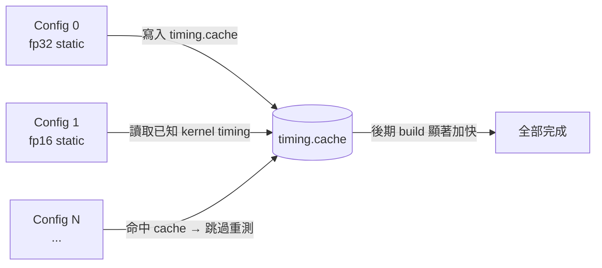
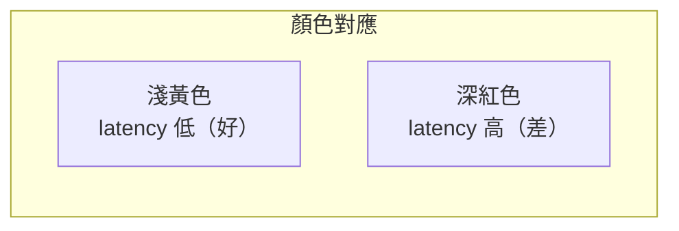
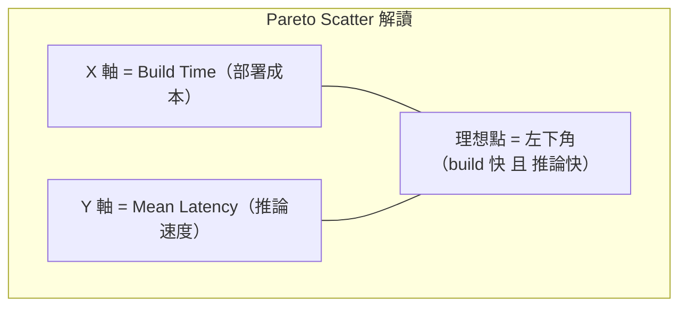
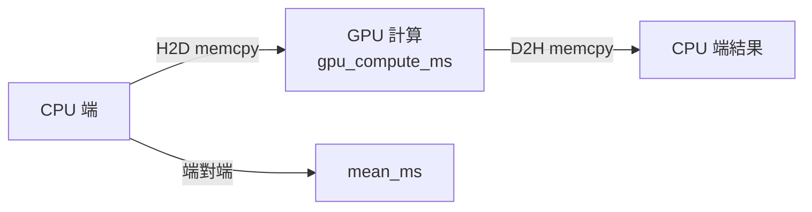
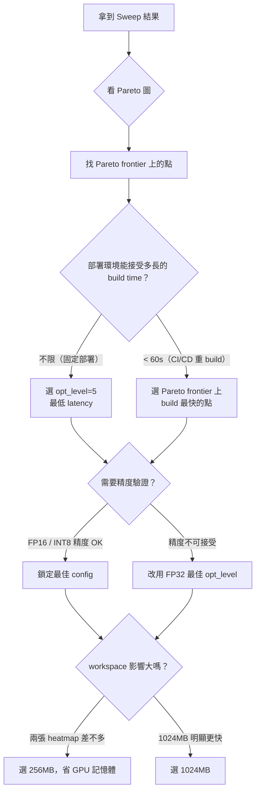
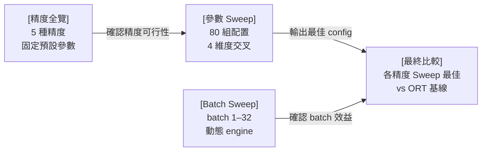

# Engine 參數 Sweep 調研

大規模參數掃描（Parameter Sweep）是找出最佳 TensorRT engine 配置的系統化方法。
本頁說明掃描哪些維度、如何解讀 Sweep 輸出，以及如何轉換成部署決策。

## 掃描維度（四個維度）

| 維度 | 選項 | GPU 要求 | 說明 |
|------|------|---------|------|
| `precision` | fp32 | 所有 GPU | 完整精度 |
| | fp16 | Pascal+ | 最常用的加速方案 |
| | bf16 | Hopper+ / Blackwell | Brain Float 16 |
| | int8 | Turing+ | 8-bit 整數，需注意精度 |
| | fp8  | Ada+ / Blackwell | 8-bit 浮點（E4M3） |
| `builderOptimizationLevel` | 0, 2, 4, 5 | — | 0 = 快速 build；5 = 最激進優化（build 最慢） |
| `workspace_mb` | 256, 1024 | — | GPU workspace 上限；影響 layer fusion 搜尋空間 |
| `batch_mode` | static | — | 固定 batch=1，與原始 ONNX 一致 |
| | dynamic | 動態 ONNX | min=1 / opt=4 / max=8；需 ONNX batch dim 為動態 |

四個維度交叉產生 5 × 4 × 2 × 2 = **80 組**配置，  
每組約 2–5 分鐘，全跑完約 2.7–6.7 小時。

> **縮減建議**：如需快速驗證，可先只保留 `precision=["fp16","int8"]`、  
> `builder_opt_level=[0,4]`、`batch_mode=["static"]`，共 4 組，約 10–20 分鐘。

---

## 動態 Batch 說明

`batch_mode=dynamic` 時，trtexec 加入形狀限制旗標讓 engine 接受可變 batch：

```
--minShapes=images:1x3x448x448
--optShapes=images:4x3x448x448
--maxShapes=images:8x3x448x448
--shapes=images:4x3x448x448      # benchmark 以 opt batch 量測
```

> **前置條件**：ONNX 模型的 batch dim 必須是動態（`dim_param`）。  
> 若模型為靜態 batch=1（`dim_value=1`），dynamic 組別在 build 時會失敗並自動跳過。  
> 詳見 [動態 Batch 工作流程](../workflow/dynamic-batch.md)。

---

## 加速技巧：Timing Cache



`--timingCacheFile` 跨所有 build 共用，後期 config 的 build 時間可縮短 50–80%。

---

## 結果解讀

### Pivot Table（依 workspace × batch_mode 分群）

```
=== workspace=1024MB  batch=static — Mean Latency (ms) ===
precision          bf16   fp16   fp32   fp8   int8
builder_opt_level
0                  3.xx   2.07   4.11   3.xx   1.xx
2                  3.xx   1.52   3.60   3.xx   1.xx
4                  3.xx   1.40   3.48   3.xx   0.xx
5                  3.xx   1.43   3.44   3.xx   0.xx
```

**橫向**（同 row）比 precision：找最快的精度類型  
**縱向**（同 column）比 opt_level 的回報遞減：opt=4→5 通常改善 < 0.1ms，但 build 時間可多 2–3 倍  
**兩張表對比** workspace 256 vs 1024：差距小 → workspace 不是瓶頸，選小的省 GPU 記憶體

---

### Heatmap（視覺化版 Pivot）



一眼找出最佳格子（最淺色），通常落在 **INT8 或 FP16 × 高 opt_level** 的交叉點。  
BF16 和 FP8 在 Blackwell 上往往呈現深色（詳見 [精度全覽比較](precision-sweep.md)）。

---

### Pareto Scatter

這是最重要的決策圖。



**Pareto frontier** 是「無法在不犧牲一方的情況下再改善另一方」的那條邊界。

| 觀察 | 決策 |
|------|------|
| opt=5 比 opt=4 只快 0.05ms，但多花 120s build | opt=4 是更好的取捨 |
| fp16 opt=2 在 frontier 上 | 這是「build 效率最佳」的點 |
| workspace 1024 與 256 幾乎重疊 | workspace 不影響此模型，選 256 |

---

### Throughput Bar

QPS（Queries Per Second）衡量批次吞吐。

| 使用場景 | 主要指標 |
|---------|---------|
| 即時推論（單張、低延遲） | `mean_ms`（越低越好） |
| 批次處理、API server | `throughput_qps`（越高越好） |

---

## `mean_ms` vs `gpu_compute_ms` 的差距



- `mean_ms - gpu_compute_ms` 就是 **I/O 搬移開銷**
- 差距大（> 0.3ms）→ I/O 是瓶頸，考慮 CUDA Graph / Pinned Memory
- 差距小 → 瓶頸在計算本身，繼續調 precision 或 opt_level

---

## 決策框架



## 情境決策矩陣

| 情境 | 推薦 precision | 推薦 opt_level | 推薦 workspace |
|------|--------------|--------------|--------------|
| 固定部署，不重 build | INT8（驗證後）或 fp16 | 5 | 256MB（除非明顯更快） |
| CI/CD 頻繁重 build | fp16 | 2 | 256MB |
| 精度要求嚴格（AOI / 醫療） | fp32 或 fp16（驗證後） | 4 | 256MB |
| GPU 記憶體緊張（< 4GB） | fp16 | 2 | 256MB |
| 最大化批次吞吐 | INT8（驗證後） | 5 | 1024MB |
| 動態 batch 推論 | fp16 | 4 | 1024MB |

---

## 與其他調研頁面的關係



> Sweep 輸出存於 `sweep/sweep_results.csv`，視覺化圖表見 `sweep/sweep_results.png`。
