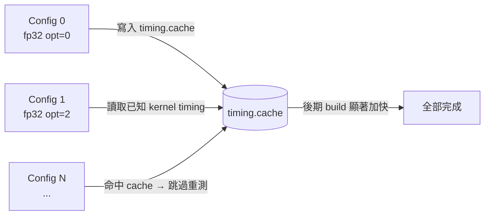
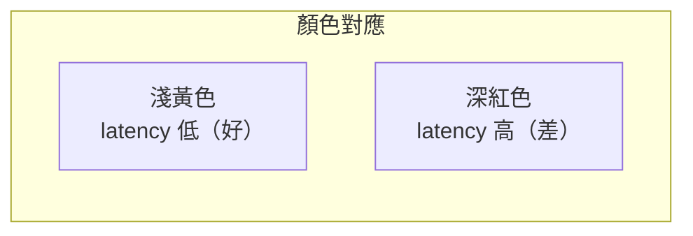
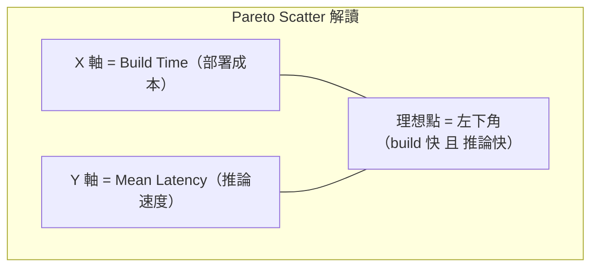
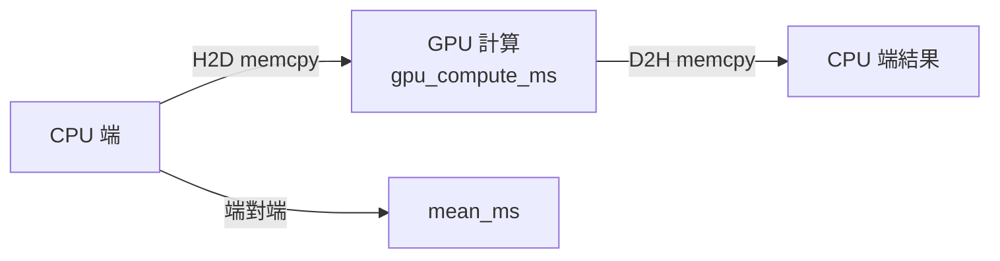
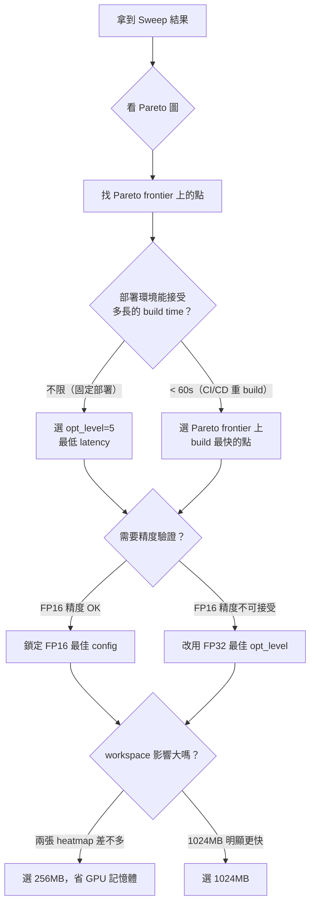

# Engine 參數 Sweep 調研

大規模參數掃描（Parameter Sweep）是找出最佳 TensorRT engine 配置的系統化方法。
本頁說明掃描哪些維度、如何解讀 `05_param_sweep.ipynb` 的輸出，以及如何轉換成部署決策。

## 掃描維度

| 參數 | 典型選項 | 說明 |
|------|---------|------|
| `precision` | fp32, fp16 | 計算精度；fp16 幾乎免費加速 |
| `builderOptimizationLevel` | 0, 2, 4, 5 | 0 = 快速 build；5 = 最激進優化（build 最慢） |
| `workspace_mb` | 256, 1024 | GPU workspace 上限；影響 layer fusion 搜尋空間 |

三個維度交叉產生 2 × 4 × 2 = **16 組**配置，每組約 2–5 分鐘，全跑完約 30–80 分鐘。

## 加速技巧：Timing Cache



`--timingCacheFile` 跨所有 build 共用，後期 config 的 build 時間可縮短 50–80%。

---

## 結果解讀

### Pivot Table（Cell 5）

```
=== workspace = 256 MB — Mean Latency (ms) ===
precision          fp16    fp32
builder_opt_level
0                  1.45    3.20
2                  1.38    3.05
4                  1.31    2.98
5                  1.29    2.97
```

**橫向**（同 row）比 precision：
- fp32 ÷ fp16 = 加速倍率，通常 1.5–2.5×

**縱向**（同 column）比 opt_level 的回報遞減：
- opt=0 → 2：改善明顯
- opt=4 → 5：改善通常 < 0.1ms，但 build 時間可能多 2–3 倍

**兩張表對比** workspace 256 vs 1024：
- 若數字幾乎相同，workspace 不是瓶頸，選小的省 GPU 記憶體

---

### Heatmap（Cell 6，圖一二）



一眼找出最佳格子（最淺色），通常落在 **fp16 × 高 opt_level** 的右下角。

---

### Pareto Scatter（Cell 6，圖三）

這是最重要的決策圖。



**Pareto frontier** 是「無法在不犧牲一方的情況下再改善另一方」的那條邊界。
落在 frontier 上的點才值得認真考慮；frontier 右上方的點被其他配置完全支配。

| 觀察 | 決策 |
|------|------|
| opt=5 比 opt=4 只快 0.05ms，但多花 120s build | opt=4 是更好的取捨 |
| fp16 opt=2 在 frontier 上 | 這是「build 效率最佳」的點 |
| workspace 1024 與 256 幾乎重疊 | workspace 不影響此模型，選 256 |

---

### Throughput Bar（Cell 6，圖四）

QPS（Queries Per Second）衡量批次吞吐。

| 使用場景 | 主要指標 |
|---------|---------|
| 即時推論（單張、低延遲） | `mean_ms`（越低越好） |
| 批次處理、API server | `throughput_qps`（越高越好） |

---

## `mean_ms` vs `gpu_compute_ms` 的差距



- `mean_ms - gpu_compute_ms` 就是 **I/O 搬移開銷**
- 差距大（> 0.3ms）→ I/O 是瓶頸，考慮 CUDA Graph / Pinned Memory
- 差距小 → 瓶頸在計算本身，繼續調 precision 或 opt_level

---

## 決策框架



## 情境決策矩陣

| 情境 | 推薦 precision | 推薦 opt_level | 推薦 workspace |
|------|--------------|--------------|--------------|
| 固定部署，不重 build | fp16 | 5 | 256MB（除非明顯更快） |
| CI/CD 頻繁重 build | fp16 | 2 | 256MB |
| 精度要求嚴格（AOI/醫療） | fp32 或 fp16（驗證後） | 4 | 256MB |
| GPU 記憶體緊張（< 4GB） | fp16 | 2 | 256MB |
| 最大化批次吞吐 | fp16 | 5 | 1024MB |

> 完整 Sweep 輸出存於 `sweep/sweep_results.csv`，視覺化圖表見 `sweep/sweep_results.png`。
> 相關實作見 `05_param_sweep.ipynb`。
