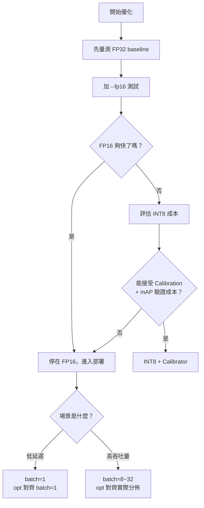
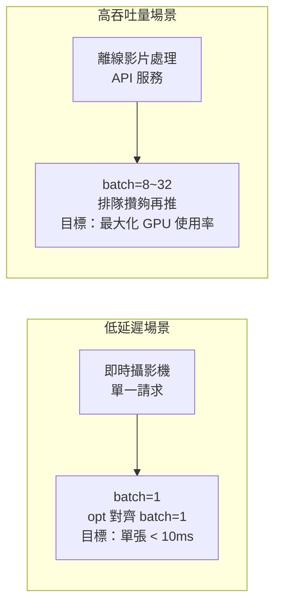

# 實務決策概念

本頁整理 YOLO + TensorRT 實際部署時的決策思路，幫助在類似專案中做出正確取捨。

## 決策流程圖



## 決策原則 1：先量測，再優化

很多人上來就問「要不要 INT8」，但正確第一步是量測：

```bash
# FP32 baseline
trtexec --onnx=yolo.onnx --optShapes=images:1x3x640x640

# FP16（幾乎免費）
trtexec --onnx=yolo.onnx --fp16 --optShapes=images:1x3x640x640
```

如果 FP16 已經夠快，就不需要 INT8 的複雜度。**過早優化是最常見的浪費。**

## 決策原則 2：低延遲 vs 高吞吐量是不同的 Engine

這是最重要的概念分歧，同一個 ONNX 應該 build 兩個不同 Engine：



OptimizationProfile 的 `opt` 對齊你的實際使用情境，TensorRT 才能針對那個形狀做最佳 kernel 選擇。

## 決策原則 3：FP16 幾乎是免費的

```
FP32（baseline）
  ↓ 加 --fp16，幾乎零風險
FP16（推薦預設）  ← 大部分專案停在這就夠了
  ↓ 如果還需要更快，且能接受驗證成本
INT8（需要 Calibration dataset + mAP 驗證）
```

YOLO 系列用 FP16 通常 mAP 差距 < 0.5%，速度快 1.5–2 倍，沒有理由不開。

## 決策原則 4：Engine 綁定 GPU，這個常常被忽略

`.engine` 不能跨 GPU 架構使用：

```
開發機（RTX 3090）build 的 engine ≠ 上線機（T4）能用的 engine

正確做法：
  方案 A：CI/CD pipeline 在目標 GPU 上 build engine
  方案 B：部署時帶著 ONNX，第一次啟動時 build & cache
```

## 決策原則 5：OptimizationProfile 的 opt 要對齊真實分佈

```python
profile.set_shape("images",
    min=(1,  3, 640, 640),
    opt=(4,  3, 640, 640),   # ← 這個影響最大
    max=(16, 3, 640, 640),
)
```

如果 90% 的請求是 batch=4，`opt` 就填 4，不要填 1 或填 max。填錯了整個 profile 的效能都會偏掉。

## 決策原則 6：INT8 Calibration 資料要有代表性

如果最終需要 INT8：

```python
class YOLOCalibrator(trt.IInt8EntropyCalibrator2):
    def __init__(self, data_loader, cache_file):
        self.data_loader = iter(data_loader)
        self.cache_file  = cache_file
        self.d_input     = cuda.mem_alloc(batch_bytes)

    def get_batch(self, names):
        try:
            batch = next(self.data_loader)
            cuda.memcpy_htod(self.d_input, batch)
            return [int(self.d_input)]
        except StopIteration:
            return None
```

Calibration 資料必須涵蓋你的實際場景（白天/夜晚、近景/遠景）。

> **常見錯誤**：用訓練集做 calibration。應使用接近上線分佈的資料。

## 場景決策矩陣

| 場景 | batch | 精度 | 動態 Shape | 備注 |
|------|-------|------|-----------|------|
| 即時攝影機（1 路） | 1 | FP16 | 固定即可 | 延遲優先 |
| 多路 NVR（8–16 路） | 8–16 | FP16 | 動態 batch | 吞吐優先 |
| 離線影片分析 | 32+ | INT8 | 固定 | 精度驗證後再上 |
| 醫療/工業缺陷檢測 | 1 | FP16 或 FP32 | 固定 | mAP 容忍度低 |
| API 服務（變動 QPS） | 動態 | FP16 | 動態 batch | 搭配 Triton |

## Benchmark 腳本化比較

要比較不同參數效能，建議腳本化執行，省去重複 build 的時間：

```bash
# 只 build 一次，存 engine
trtexec --onnx=yolo.onnx --fp16 \
  --minShapes=images:1x3x640x640 \
  --optShapes=images:4x3x640x640 \
  --maxShapes=images:16x3x640x640 \
  --saveEngine=yolo_fp16.engine

# 之後測不同 batch，不用重新 build
trtexec --loadEngine=yolo_fp16.engine --shapes=images:1x3x640x640
trtexec --loadEngine=yolo_fp16.engine --shapes=images:4x3x640x640
trtexec --loadEngine=yolo_fp16.engine --shapes=images:8x3x640x640
```

FP32 vs FP16 需要各 build 一次，但不同 batch size 不用重複 build。詳見 [評測方法論](methodology.md)。
