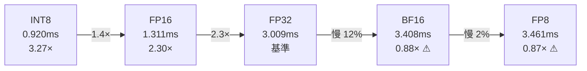
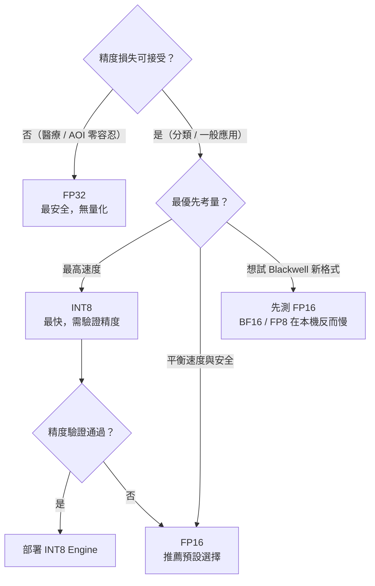

# 精度全覽比較

在固定 trtexec 預設參數（不加任何額外調優旗標）的條件下，  
系統化比較 TensorRT 支援的五種計算精度，量化每種精度的延遲與吞吐量。

## 五種精度概覽

| 精度 | trtexec 旗標 | 說明 | GPU 要求 |
|------|------------|------|---------|
| FP32 | 無 | TensorRT 預設，完整精度 | 所有 GPU |
| FP16 | `--fp16` | 半精度浮點，最常用 | Pascal+ |
| BF16 | `--bf16` | Brain Float 16，指數範圍更大 | Hopper+ / Blackwell |
| INT8 | `--int8` | 8-bit 整數，無校準時用合成 PTQ | Turing+ |
| FP8  | `--fp8`  | 8-bit 浮點（E4M3 格式） | Ada+ / Blackwell |

## 實測結果（RTX 5070 Laptop, SM 12.0 / Blackwell）

| 精度 | Mean (ms) | Median (ms) | P95 (ms) | P99 (ms) | QPS | vs FP32 |
|------|-----------|-------------|----------|----------|-----|---------|
| FP32    | 3.009 | 2.973 | 3.157 | 3.518 | 319.1 | 1.00× |
| FP16    | 1.311 | 1.304 | 1.482 | 1.659 | 701.2 | **2.30×** |
| BF16    | 3.408 | 3.485 | 3.539 | 3.658 | 283.9 | 0.88× ⚠ |
| INT8    | 0.920 | 0.867 | 1.199 | 1.365 | 961.8 | **3.27×** |
| FP8     | 3.461 | 3.543 | 3.594 | 3.771 | 279.0 | 0.87× ⚠ |
| ORT-GPU | 38.196 | 35.261 | 57.250 | 81.521 | 26.2 | 0.08× |

> ORT-GPU 實際執行於 CPU：SM 12.0 / Blackwell 目前未受 onnxruntime-gpu 支援，  
> Session 建立時 `CUDAExecutionProvider` 初始化失敗並靜默 fallback。  
> TensorRT 10.8 能跑是因為它針對 CUDA 12.8 + SM 12.0 獨立編譯，不依賴 cuDNN 路徑。

---

## 重要發現：BF16 和 FP8 比 FP32 還慢

「更小位元 = 更快」並非必然。在 Blackwell（SM 12.0）上：

| 精度 | 現象 | 根本原因 |
|------|------|---------|
| BF16 | 比 FP32 慢 12% | TRT 10.8 對 SM 12.0 的 BF16 Tensor Core kernel 尚未充分優化，部分層退回 FP32 路徑 |
| FP8  | 比 FP32 慢 15% | FP8 E4M3 量化/反量化開銷大於計算節省；需更大型模型（大量 matmul）才能回本 |
| INT8 | 比 FP32 快 3.3× | Turing+ 的 INT8 Tensor Core 支援成熟，此分類模型大小足以受益 |

---

## 精度選擇決策樹

| 場景 | 推薦精度 | 理由 |
|------|---------|------|
| 分類模型（本專案） | FP16 或 INT8 | 任務特性不敏感；FP16 安全，INT8 最快 |
| 偵測 / 分割（高精確度） | FP16 | 比 FP32 快 2.3×，損失極小 |
| 醫療 / AOI（零容忍） | FP32 | 不量化 |
| Blackwell GPU 嘗試新格式 | 先測 FP16 | BF16 / FP8 在本機反而較慢 |
| 批次吞吐最大化 | INT8（驗證後） | 962 QPS vs FP16 的 701 QPS |

---

## GPU 計算時間分解

`GPU Compute Time` 排除 H2D/D2H 搬移，反映純 Tensor Core 計算時間。

| 精度 | GPU Compute (ms) | Mean (ms) | I/O 開銷 |
|------|-----------------|-----------|---------|
| FP32 | 2.893 | 3.009 | 0.116ms |
| FP16 | 1.201 | 1.311 | 0.110ms |
| BF16 | 3.296 | 3.408 | 0.112ms |
| INT8 | 0.810 | 0.920 | 0.110ms |
| FP8  | 3.347 | 3.461 | 0.114ms |

所有精度的 I/O 開銷幾乎相同（約 0.11ms），效能差異完全來自計算本身，  
排除了「BF16 / FP8 可能在資料搬移上佔優」的假設。

---

## 與其他調研頁面的關係

本頁的測試條件是**固定預設參數**，反映精度選擇本身的效能差異。

若進一步搭配 `builderOptimizationLevel` 與 `workspace` 調優，  
可在此基礎上再獲得數 % 的改善（FP16 預設 1.311ms → Sweep 最佳約 1.3ms），  
說明此模型對調優參數不敏感；**精度選擇才是最大的效能槓桿**。

> 完整四維度參數 Sweep（精度 × opt_level × workspace × batch_mode）見 [Engine 參數 Sweep 調研](param-sweep.md)。  
> 各精度 Sweep 最佳配置的端對端比較見 [最終效能比較](comparison.md)。
