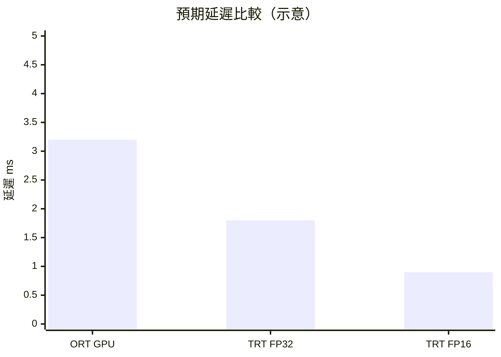
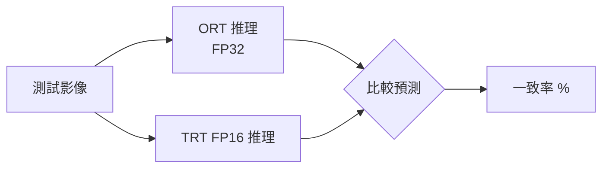

# 結果分析

## 預期效能趨勢



## 結果輸出

評測完成後產生：

1. **長條圖** — 各後端 mean latency 比較
2. **匯總表** — latency (min/mean/median/p99) + QPS

## 加速比計算

```
加速比 = ORT_mean_latency / TRT_mean_latency
```

典型預期（視 GPU 而定）：
- TRT FP32 vs ORT：**1.5x ~ 3x**
- TRT FP16 vs ORT：**3x ~ 6x**

## 準確率比對

對測試集執行推理並比較 ORT 與 TRT FP16 的預測結果：



> 若一致率 < 99%，需檢查前處理對齊或考慮使用 FP32 引擎。

## 分析注意事項

- trtexec 延遲為純 GPU 計算時間（不含 CPU-GPU 傳輸）
- ORT 手動計時延遲包含資料傳輸，**兩者不可直接比較**
- 公平比較需使用相同計時方法（透過 Python TRT API 手動計時）
