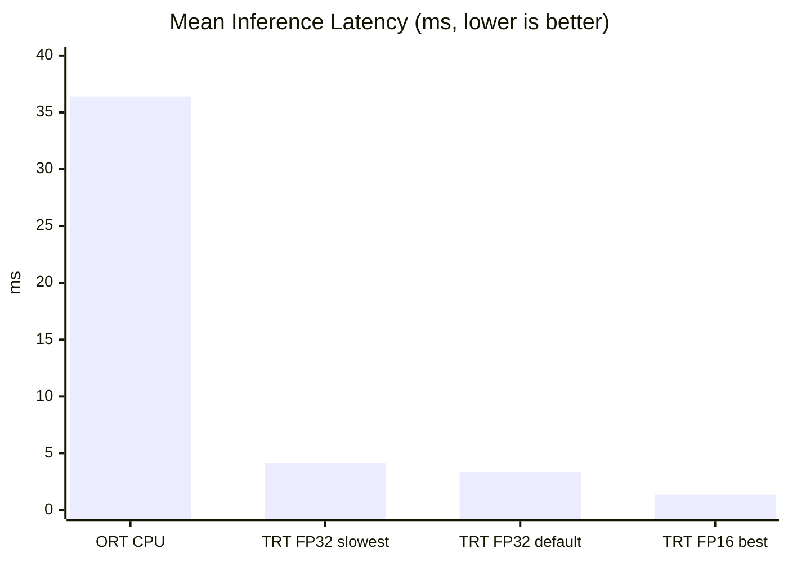
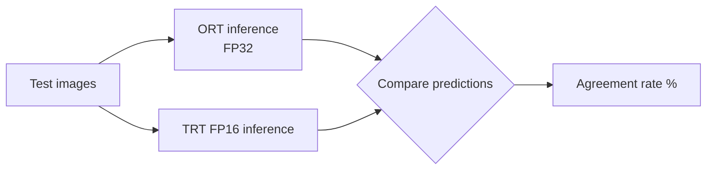

# 結果分析

本頁記錄 H.onnx 在 RTX 5070 Laptop (SM 12.0) 上的實測效能數字。

## 實測延遲比較



## 完整實測表

| 方案 | Mean (ms) | Median (ms) | P95 (ms) | P99 (ms) | QPS | vs ORT |
|------|-----------|-------------|----------|----------|-----|--------|
| ORT CPU（初始） | 36.397 | 30.881 | 59.087 | 97.220 | 27.5 | 1.0× |
| TRT FP32 最慢（opt=0, ws=1024MB） | 4.125 | 4.171 | — | — | 234.9 | 8.8× |
| TRT FP32 預設（無調參） | 3.329 | 3.417 | — | — | 288.5 | 10.9× |
| TRT FP16 最佳（opt=4, ws=1024MB） | 1.383 | 1.411 | — | — | 669.1 | **26.3×** |

> 完整四方案比較分析見 [四方案效能總比較](comparison.md)。

## 加速比計算

```
加速比 = ORT_mean_latency / TRT_mean_latency
```

實測結果（H.onnx, RTX 5070 Laptop）：

- TRT FP32 預設 vs ORT CPU：**10.9×**
- TRT FP16 最佳 vs ORT CPU：**26.3×**
- TRT FP16 最佳 vs TRT FP32 預設：**2.4×**

> 注意：ORT 基線為 CPU 推論（Blackwell SM 12.0 不受 onnxruntime-gpu 支援，GPU EP 回退 CPU）。  
> 若 ORT 能以 GPU 運行，加速比會縮小；TRT FP16 vs ORT GPU 通常在 **3×–8×** 範圍。

## 結果輸出

評測完成後產生：

1. **四方案 2×2 圖表** — 對數刻度延遲、QPS、尾延遲、加速比
2. **彙總 DataFrame** — 含 `vs ORT 加速比` 與 `vs 預設加速比` 兩欄

## 準確率比對

對測試集執行推理並比較 ORT 與 TRT FP16 的預測結果：



> 若一致率 < 99%，需檢查前處理對齊或考慮使用 FP32 引擎。

## 分析注意事項

- trtexec 延遲為純 GPU 計算時間（不含 CPU-GPU 傳輸）
- ORT 手動計時延遲包含資料傳輸；本機測試為 CPU 推論，兩者不可直接比較計算資源效率
- 公平的 GPU-to-GPU 比較需使用相同計時方法（透過 Python TRT API 手動計時）
