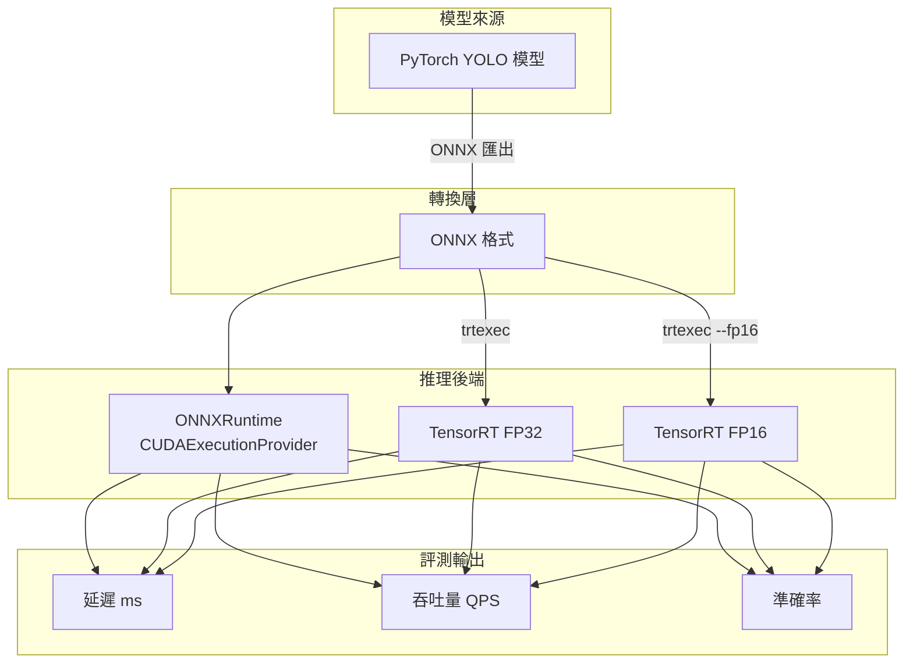

# 整體架構

## 系統元件關係圖

## 元件說明

### trtexec
NVIDIA 提供的命令列工具，負責：
1. 將 ONNX 解析為 TensorRT 網路
2. 最佳化並序列化為 `.engine` 檔案
3. 內建效能基準測試

### TensorRT Python API
用於反序列化引擎並執行推理：
- 需要 `tensorrt` wheel + `cuda-python`
- 支援手動控制記憶體與 stream 執行

### ONNXRuntime GPU
- 透過 `CUDAExecutionProvider` 在 GPU 執行
- 作為評測基準線（不需額外轉換）
