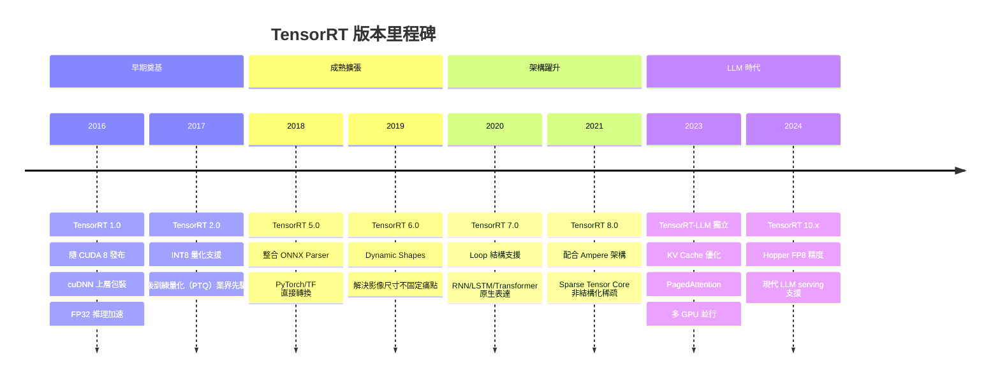

# TensorRT 發展歷史

## 版本演進時間軸

## 各階段重點說明

### 早期奠基（2016–2018）

TensorRT 1.0 於 2016 年隨 CUDA 8 發布，最初定位為 cuDNN 的上層包裝，主打 FP32 推理加速。2.0 帶來了 INT8 量化，是業界少數支援後訓練量化（Post-training Quantization）的推理框架，影響深遠。

### 成熟擴張（2018–2020）

5.0 整合了 ONNX Parser，讓 PyTorch/TensorFlow 模型可以直接轉換，大幅降低使用門檻。6.0 的 Dynamic Shapes 解決了影像尺寸不固定的痛點，在電腦視覺領域廣泛採用。

### 架構躍升（2020–2022）

7.0 增加 Loop 結構支援，首次讓 RNN、LSTM 和 Transformer 類模型可以原生表達，不再需要手動展開。8.0 配合 Ampere 架構，利用 Sparse Tensor Core 支援非結構化稀疏性，理論上可額外帶來 2x 加速。

### LLM 時代（2023–至今）

面對 GPT/LLaMA 等大語言模型需求爆發，NVIDIA 將 LLM 推理獨立出來打造 TensorRT-LLM，支援 Hopper 的 FP8 精度、多 GPU 並行、PagedAttention 等現代 LLM serving 必備技術。

## 各版本關鍵特性對比

| 版本 | 關鍵特性 | 影響 |
|------|---------|------|
| 1.0 | FP32 推理 | 建立推理優化基礎 |
| 2.0 | INT8 PTQ | 降低記憶體、加速推理 |
| 5.0 | ONNX Parser | 大幅降低模型轉換門檻 |
| 6.0 | Dynamic Shapes | 支援變動輸入尺寸 |
| 7.0 | Loop 支援 | Transformer 模型可原生表達 |
| 8.0 | Sparse Tensor Core | Ampere 架構稀疏加速 |
| 10.x | FP8、TRT-LLM | LLM 時代推理優化 |

## TensorRT-LLM（新世代）

專為大語言模型設計的擴展版本，支援：

- **KV Cache 優化**：減少 Attention 計算中重複的 K/V 計算
- **Paged Attention**：動態管理 KV Cache 記憶體，提升 GPU 使用率
- **多 GPU 並行**：張量並行（Tensor Parallelism）+ 流水線並行（Pipeline Parallelism）
- **主流模型支援**：LLaMA、GPT、Falcon、Mistral 等

> 本專案使用 TensorRT 10.8.0.43，屬於 LLM 時代的穩定版本，主要利用其 ONNX 解析、FP16/FP32 精度切換及動態 Shape 功能。
