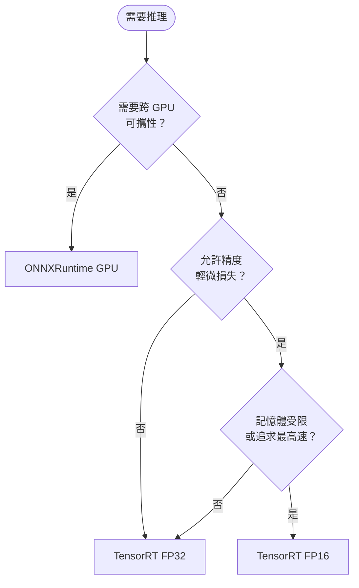

# 推理引擎比較

## 比較矩陣

| 特性 | ONNXRuntime GPU | TensorRT FP32 | TensorRT FP16 |
|------|----------------|---------------|---------------|
| 格式 | .onnx | .engine | .engine |
| 精度 | FP32 | FP32 | FP16 |
| 建置時間 | 無 | 數分鐘 | 數分鐘 |
| 引擎可攜性 | 跨平台 | 綁定 GPU 架構 | 綁定 GPU 架構 |
| 記憶體用量 | 中 | 中 | 低（約 50%）|
| 推理速度 | 基準 | 快 | 最快 |
| 精度損失 | 無 | 無 | 極小 |

## 決策流程

## 引擎相容性注意事項

TensorRT 引擎**綁定**以下環境，跨環境需重新建置：
- GPU 架構（如 Ampere vs Ada Lovelace）
- TensorRT 版本
- CUDA 版本
