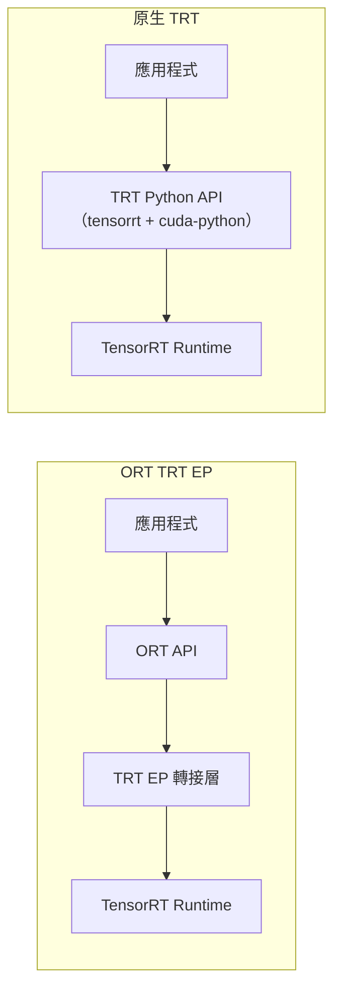
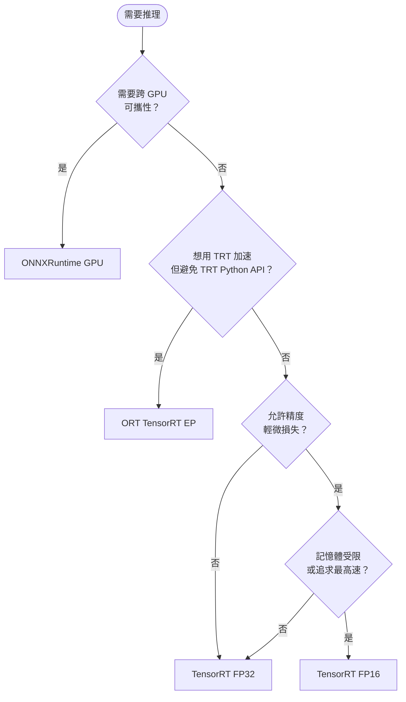

# 推理引擎比較

## 比較矩陣

| 特性 | ORT GPU | ORT TRT EP | TensorRT FP32 | TensorRT FP16 |
|------|---------|------------|---------------|---------------|
| 格式 | .onnx | .onnx | .engine | .engine |
| 精度 | FP32 | FP32 / FP16 | FP32 | FP16 |
| 建置時間 | 無 | 首次執行時建置（快取後可略） | 數分鐘 | 數分鐘 |
| 引擎可攜性 | 跨平台 | 綁定 GPU 架構 | 綁定 GPU 架構 | 綁定 GPU 架構 |
| 記憶體用量 | 中 | 中（ORT overhead + TRT） | 中 | 低（約 50%）|
| 推理速度 | 基準 | 接近 TRT 原生 | 快 | 最快 |
| 精度損失 | 無 | 無（FP32 模式） | 無 | 極小 |
| API 複雜度 | 低 | 低（ORT 介面） | 中（trtexec CLI） | 中 |

## ORT TensorRT Execution Provider

ORT TRT EP 讓你**透過標準 ORT 介面**呼叫 TensorRT，省去直接操作 TRT Python API 的複雜度。

```python
sess = ort.InferenceSession(
    "model.onnx",
    providers=[
        ("TensorrtExecutionProvider", {
            "device_id": 0,
            "trt_engine_cache_enable": True,
            "trt_engine_cache_path": "./engines",
        }),
        "CUDAExecutionProvider",
    ]
)
```

### 與原生 TRT 的差異



ORT TRT EP 多了一層轉接，通常會帶來 **0.5–2 ms** 額外開銷（視模型大小而定）；換來的是更簡潔的 API 且無需安裝 `tensorrt` Python bindings。

## 決策流程



## 引擎相容性注意事項

TensorRT 引擎（包含 ORT TRT EP 快取的 `.engine`）**綁定**以下環境，跨環境需重新建置：
- GPU 架構（如 Ampere vs Ada Lovelace）
- TensorRT 版本
- CUDA 版本
