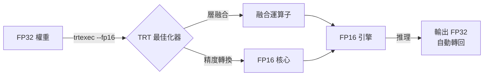

# 資料型別與精度

## 浮點格式比較

| 格式 | 位元數 | 指數位 | 尾數位 | 動態範圍 | 用途 |
|------|--------|--------|--------|----------|------|
| FP32 | 32 | 8 | 23 | ~1e-38 ~ 3e38 | 訓練、精確推理 |
| FP16 | 16 | 5 | 10 | ~6e-5 ~ 65504 | 快速推理 |
| INT8 | 8 | — | — | -128 ~ 127 | 需校正集，最快 |

## FP16 量化流程

## 精度影響

本專案分類模型（9 類）在 FP16 下精度損失通常可忽略，因為：
1. 分類任務只需辨別最高 logit，對絕對值不敏感
2. YOLO 架構已在較低精度下驗證穩定
3. 應透過測試集量化比較 ORT vs TRT FP16 準確率以驗證
