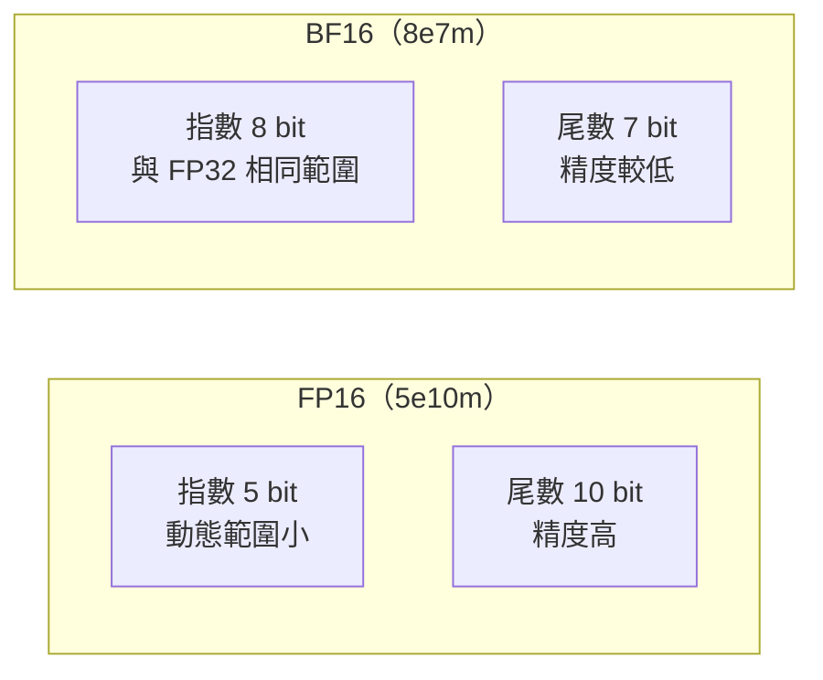
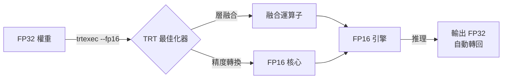
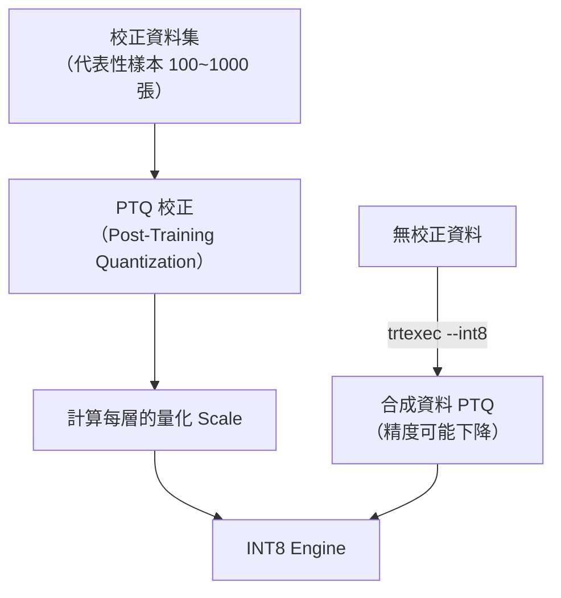
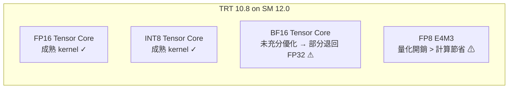

# 資料型別與精度

## 浮點格式比較

| 格式 | 位元數 | 指數位 | 尾數位 | 動態範圍 | GPU 要求 | 用途 |
|------|--------|--------|--------|----------|---------|------|
| FP32 | 32 | 8 | 23 | ~1e-38 ~ 3e38 | 所有 GPU | 訓練、精確推理 |
| FP16 | 16 | 5 | 10 | ~6e-5 ~ 65504 | Pascal+ | 快速推理（主流） |
| BF16 | 16 | 8 | 7  | ~1e-38 ~ 3e38 | Hopper+ / Blackwell | 訓練友善，推理視 GPU 而定 |
| INT8 | 8  | — | —  | -128 ~ 127 | Turing+ | 需校正集，推理最快 |
| FP8  | 8  | 4 | 3  | E4M3 格式 | Ada+ / Blackwell | 最小 footprint，效果視 GPU 而定 |

### BF16 vs FP16 的差異

BF16 與 FP32 共享相同的指數範圍，因此從 FP32 訓練模型轉換到 BF16 推理時，  
不容易發生 overflow / underflow——這是 BF16 的主要優勢。  
但尾數只有 7 bit，數值精度低於 FP16 的 10 bit。

---

## 量化流程

### FP16 量化

### INT8 量化流程

INT8 需要將 FP32 的連續值映射到 [-128, 127] 的整數區間，需要「校正（Calibration）」：

> 使用合成資料的 INT8 engine build 可以成功，速度數據有效，但**分類精度可能低於 FP16**。  
> 正式部署前必須用真實資料做精度驗證。

---

## 實測效能（RTX 5070 Laptop, SM 12.0 / Blackwell）

| 精度 | Mean (ms) | vs FP32 | 備註 |
|------|-----------|---------|------|
| FP32 | 3.009 | 1.00× | 基準 |
| FP16 | 1.311 | **2.30×** | 推薦 |
| BF16 | 3.408 | 0.88× ⚠ | 比 FP32 慢！ |
| INT8 | 0.920 | **3.27×** | 最快 |
| FP8  | 3.461 | 0.87× ⚠ | 比 FP32 慢！ |

### 為什麼 BF16 和 FP8 在 Blackwell 上反而慢？

「更小位元 = 更快」是通用規律，但有例外條件：
- **BF16**：TRT 10.8 在 SM 12.0 上的 BF16 kernel 尚未完全優化，部分層退回 FP32 路徑
- **FP8**：量化 / 反量化的開銷需要足夠大的模型（大量 matmul）才能被計算節省彌補；本專案模型偏小，無法回本

---

## 精度影響

本專案分類模型（6 或 9 類輸出）在 FP16 下精度損失通常可忽略，因為：
1. 分類任務只需辨別最高 logit，對絕對值不敏感
2. YOLO 架構已在較低精度下驗證穩定
3. INT8 使用合成 PTQ 時，精度有下降風險——應透過測試集量化比較 ORT vs TRT INT8 的準確率

## 精度選擇建議

| 場景 | 推薦 | 理由 |
|------|------|------|
| 快速上線，不想驗證 | FP16 | 2.3× 加速，風險極低 |
| 最高速度，可接受驗證 | INT8 | 3.3× 加速，需測精度 |
| 醫療 / 工業 AOI | FP32 | 不量化，最安全 |
| Blackwell GPU 新格式 | 先測 FP16 | BF16 / FP8 在本機目前較慢 |

> 詳細的五精度實測比較見 [精度全覽比較](../benchmark/precision-sweep.md)。
