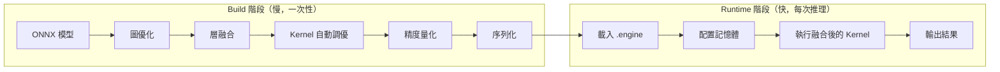
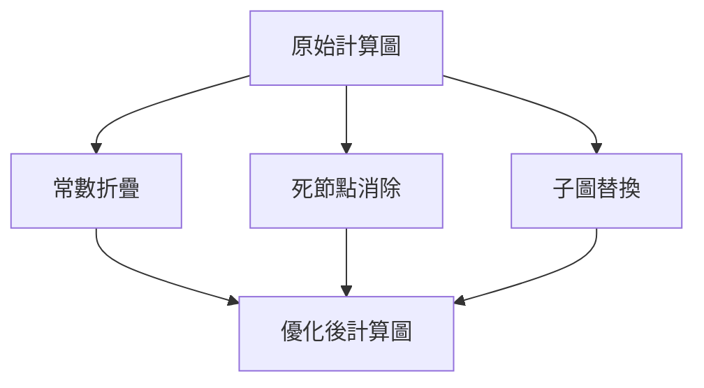
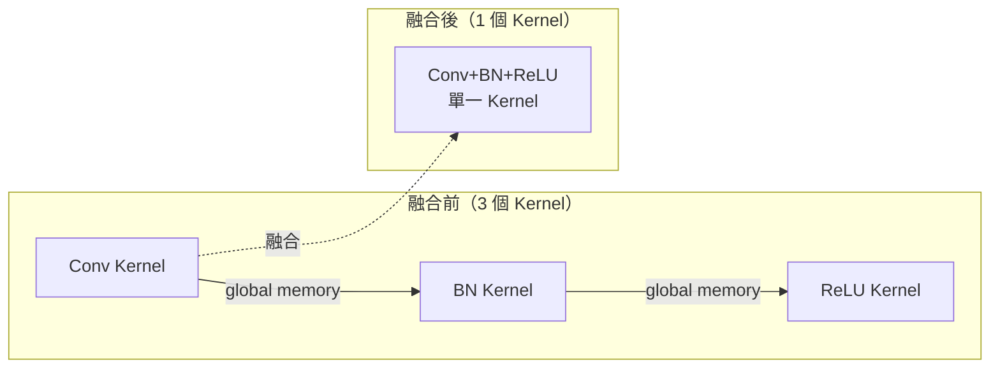
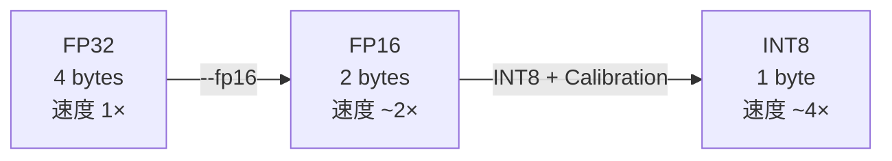
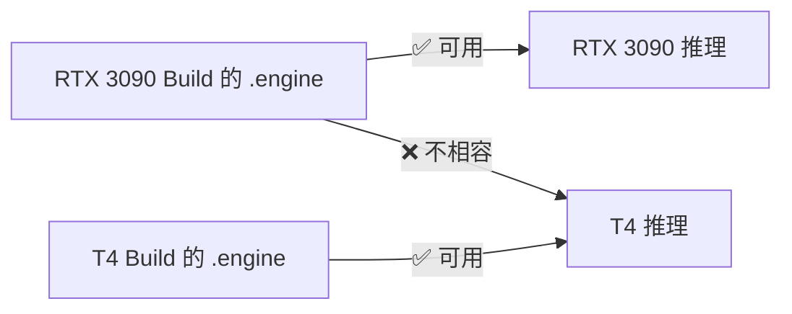

# TensorRT 核心優化原理

TensorRT 的核心在於 **Build 階段做大量分析與優化**，Runtime 階段只剩純執行。

## 整體架構



## 五大優化技術

### 1. 圖優化（Graph Optimization）

TensorRT 把計算圖當成靜態圖分析，執行三類操作：



| 操作 | 說明 | 範例 |
|------|------|------|
| 常數折疊 | Build 時計算固定值 | `weight × 2.0` 直接算好 |
| 死節點消除 | 移除無用節點 | 輸出沒被使用的中間計算 |
| 子圖替換 | 換成 TRT 高效版本 | LayerNorm → 融合 Kernel |

### 2. 層融合（Layer Fusion）

**這是 TensorRT 最大的加速來源。**

GPU Kernel 的啟動成本不低，而且每次寫回 global memory 再讀出來都會消耗頻寬。融合後中間結果全部留在 register 或 shared memory 裡。



速度提升幅度：**2–4 倍**（取決於融合層數）

### 3. Kernel 自動調優（Auto-tuning）

同一個 Conv2d，cuDNN 裡有十幾種實作，哪個最快取決於 GPU 型號、輸入大小、channel 數：

| 演算法 | 適合場景 |
|--------|---------|
| implicit GEMM | 通用，各種大小 |
| Winograd | 小卷積核（3×3），計算量少 |
| FFT | 大卷積核，頻域計算 |
| direct convolution | 特定 channel 組合 |

TensorRT 在 Build 時實際跑一遍所有候選，量測時間，選最快的記錄下來。

> 這就是為什麼 Build 很慢（幾分鐘到幾十分鐘），但 Runtime 很快。

### 4. 精度量化（Precision Calibration）



| 精度 | 位元數 | 相對速度 | 備注 |
|------|--------|---------|------|
| FP32 | 4 bytes | 1× | 訓練用，推理基準 |
| FP16 | 2 bytes | ~2× | Tensor Core 加速，大部分模型精度無損 |
| INT8 | 1 byte | ~4× | 需要 Calibration 校準，精度需驗證 |

FP16 幾乎是免費的加速，YOLO 用 `--fp16` 通常精度差異在 mAP < 0.5% 以內。詳見 [資料型別與精度](precision.md)。

### 5. 序列化 Engine

Build 結果存成 `.engine` 檔，裡面包含：
- 已選定的 kernel 實作（Auto-tuning 結果）
- 已融合的計算圖
- 已量化的權重

Runtime 載入後直接執行，不需要再做任何分析。

**重要限制**：`.engine` 綁定 GPU 型號。換一張不同架構的 GPU（如 T4 → A100），Engine 必須重新 Build。



## 對本專案的優化順序

針對 YOLO 分類模型，最有感的優化排序：

```
層融合 > FP16 > Kernel 調優 > INT8
```

1. **層融合**：自動發生，無需設定
2. **FP16**：加 `--fp16` 參數，幾乎零風險
3. **Kernel 調優**：Build 時自動完成
4. **INT8**：需要 Calibration dataset，驗證後再考慮
