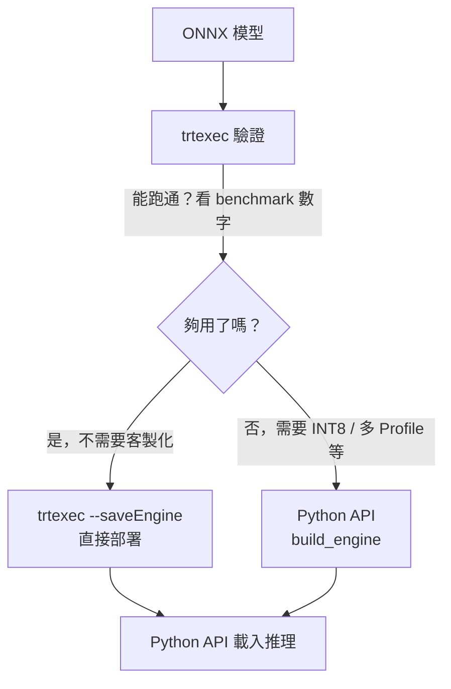

# trtexec vs Python API

## 快速對比

| | trtexec | import tensorrt |
|--|---------|----------------|
| 使用方式 | 命令列 | Python 程式碼 |
| 適合場景 | 快速驗證、benchmark | 生產部署、客製化 |
| 客製化程度 | 低（參數有限） | 高（完全控制） |
| Plugin 支援 | 有限 | 完整 |
| 除錯資訊 | 豐富的內建 log | 自己處理 |
| 推理執行 | 只能 benchmark，不能拿結果 | 完整推理流程 |
| 輸出 .engine | 支援（`--saveEngine`） | 支援 |

> **關鍵澄清**：trtexec 加 `--saveEngine` 產出的 `.engine` 完全可以拿去 Python API 載入推理，兩者並非互斥。

## trtexec 命令列

```bash
# 快速轉換測試
trtexec --onnx=yolo.onnx --saveEngine=yolo.engine --fp16

# 動態 batch
trtexec \
  --onnx=yolo.onnx \
  --saveEngine=yolo.engine \
  --fp16 \
  --minShapes=images:1x3x640x640 \
  --optShapes=images:4x3x640x640 \
  --maxShapes=images:16x3x640x640

# 載入已有 engine 做 benchmark
trtexec \
  --loadEngine=yolo.engine \
  --shapes=images:4x3x640x640 \
  --iterations=100
```

trtexec **不回傳推理結果**，只報告吞吐量和延遲數字。適合驗證和量測，不適合需要取用輸出的場景。

## Python API

Python API 能做到 trtexec 做不到的事：

```python
import tensorrt as trt
import numpy as np

builder = trt.Builder(trt.Logger(trt.Logger.WARNING))
network = builder.create_network(
    1 << int(trt.NetworkDefinitionCreationFlag.EXPLICIT_BATCH)
)
config = builder.create_builder_config()

# ★ 自訂 INT8 Calibrator
config.int8_calibrator = MyCalibrator(calib_data, "calib_cache.bin")

# ★ 針對特定層強制精度
layer = network.get_layer(network.num_layers - 1)
layer.precision = trt.float32

# ★ 設定記憶體上限
config.set_memory_pool_limit(trt.MemoryPoolType.WORKSPACE, 2 << 30)  # 2GB

# ★ 多個 OptimizationProfile（不同解析度）
profile1 = builder.create_optimization_profile()
profile1.set_shape("images",
    min=(1,3,640,640), opt=(4,3,640,640), max=(8,3,640,640))

profile2 = builder.create_optimization_profile()
profile2.set_shape("images",
    min=(1,3,1280,1280), opt=(2,3,1280,1280), max=(4,3,1280,1280))

config.add_optimization_profile(profile1)
config.add_optimization_profile(profile2)
```

## 實務工作流程：兩者搭配使用



## 何時只用 trtexec 就夠

| 需求 | trtexec 是否足夠 |
|------|----------------|
| FP32 / FP16 轉換 + 部署 | ✅ 夠 |
| 動態 batch（單一 profile） | ✅ 夠 |
| 快速量測不同參數效能 | ✅ 夠 |
| 自訂 INT8 Calibrator | ❌ 需要 Python API |
| 針對特定層強制精度 | ❌ 需要 Python API |
| 程式碼動態決定 build 參數 | ❌ 需要 Python API |
| 多個 OptimizationProfile（不同解析度） | ❌ 需要 Python API |

本專案（YOLO 分類，FP16）：直接用 trtexec 即可。
