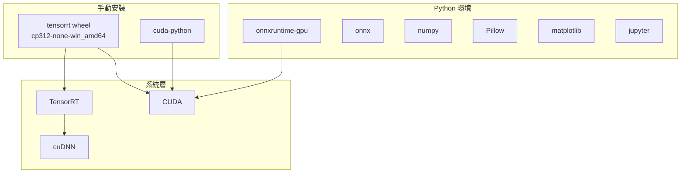

# 依賴項目

## 依賴關係圖

## 依賴說明

| 套件 | 用途 |
|------|------|
| `onnxruntime-gpu` | GPU 加速的 ONNX 推理，作為效能基準線 |
| `onnx` | 讀取與檢查 ONNX 模型圖結構 |
| `numpy` | 張量操作與前處理 |
| `Pillow` | 影像讀取與縮放 |
| `matplotlib` | 繪製效能比較圖表 |
| `tensorrt` | TRT Python API（需手動安裝 wheel）|
| `cuda-python` | 低階 CUDA 操作（記憶體配置、stream 控制）|

## 安裝注意事項

- 標準 Python 依賴透過套件管理工具安裝（`pyproject.toml` 管理）
- TensorRT Python 綁定**不在 PyPI**，需從 NVIDIA 官方下載頁取得對應版本 wheel 手動安裝
- `tensorrt` 和 `cuda-python` 為**選用依賴**：不安裝時，TRT Python API 相關功能會優雅跳過，其餘推理功能正常執行
