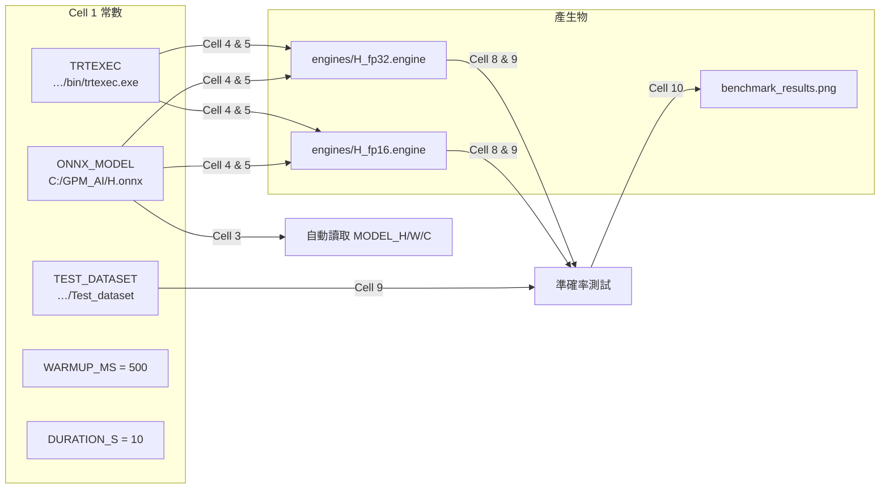

# 路徑設定

## 路徑對應圖



## 路徑常數（Cell 1）

| 常數 | 路徑 |
|------|------|
| `TRTEXEC` | `C:/Users/edisonhsieh/Downloads/TensorRT-10.8.0.43.Windows.win10.cuda-12.8/TensorRT-10.8.0.43/bin/trtexec.exe` |
| `ONNX_MODEL` | `C:/GPM_AI/H.onnx` |
| `TEST_DATASET` | `C:/Users/edisonhsieh/Downloads/Test_dataset` |
| `ENGINE_FP32` | `engines/H_fp32.engine` |
| `ENGINE_FP16` | `engines/H_fp16.engine` |

## 驗證（Cell 2）

Cell 2 檢查所有路徑是否存在，若有缺失會提早報錯，避免後續 Cell 失敗。

## trtexec 環境變數設定（可選）

trtexec 在本專案以完整路徑呼叫，不需要設環境變數。但若想在終端機直接輸入 `trtexec`，可以加入 PATH：

### PowerShell（本次 session）

```powershell
$env:PATH += ";C:\Users\edisonhsieh\Downloads\TensorRT-10.8.0.43.Windows.win10.cuda-12.8\TensorRT-10.8.0.43\bin"
```

### 永久設定（系統環境變數）

```powershell
[System.Environment]::SetEnvironmentVariable(
    "PATH",
    $env:PATH + ";C:\Users\edisonhsieh\Downloads\TensorRT-10.8.0.43.Windows.win10.cuda-12.8\TensorRT-10.8.0.43\bin",
    "User"
)
```

設定後重啟終端機，即可直接使用 `trtexec --help`。

> **注意**：`nvcc` 執行時若沒給 `.cu` 檔案，會顯示 `nvcc fatal: No input files specified`，這是**正常行為**，代表 CUDA 編譯器已安裝。驗證 CUDA 版本請用 `nvcc --version`。
