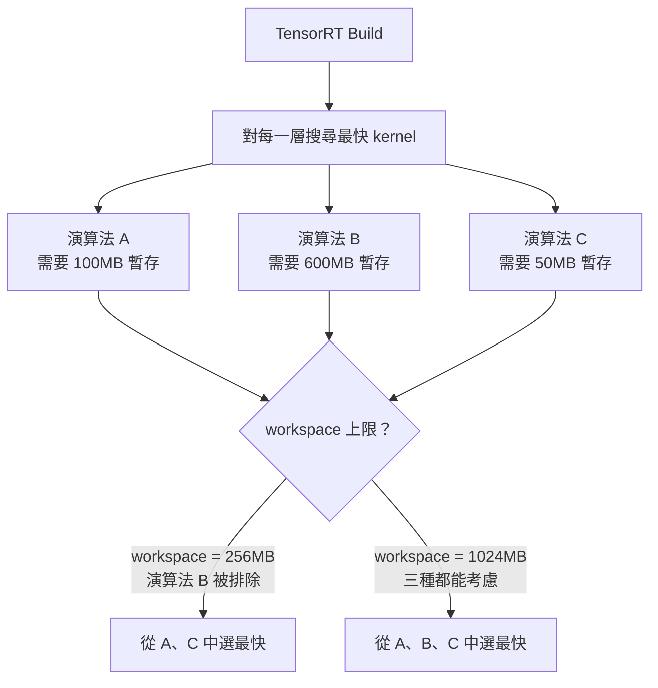
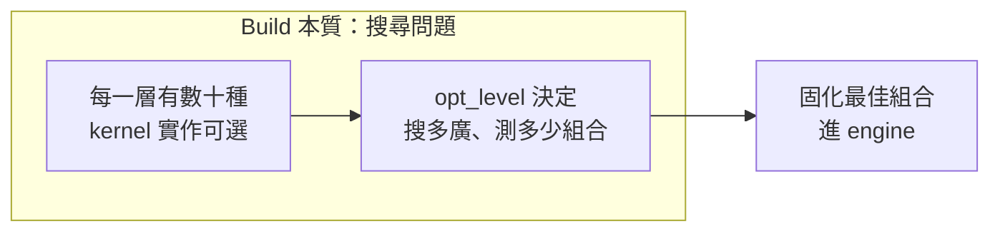
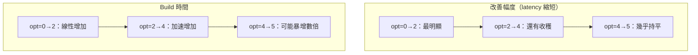
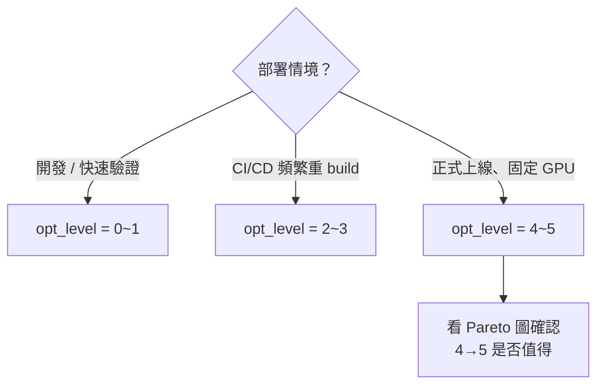

# Engine Build 參數詳解

TensorRT build engine 時有兩個最關鍵的調校參數：`workspace` 與 `builderOptimizationLevel`。
兩者共同決定 build 時間與最終 engine 推論速度的取捨。

---

## Workspace

### 定義

Workspace 是 TensorRT 在 build engine 時，允許使用的**臨時 GPU 記憶體上限**（單位：MB）。

### 為什麼需要 Workspace

TensorRT 對每一層會評估多種 kernel 演算法（例如 im2col、FFT convolution、Winograd）。
有些演算法需要額外的暫存空間才能執行：



### 重要觀念

- **只影響 build 階段**，不影響 inference 時的記憶體用量
- Workspace 越大 → 可考慮演算法越多 → engine 可能更快
- 對**小模型**（分類網路、輸入 < 512²）256MB 通常已綽綽有餘

### 設定方式

```bash
# trtexec
trtexec --onnx=model.onnx --memPoolSize=workspace:256m

# Python API
config.set_memory_pool_limit(trt.MemoryPoolType.WORKSPACE, 256 * 1024 * 1024)
```

### 決策建議

| 模型規模 | 建議 workspace |
|---------|--------------|
| 分類小網路（< 10M params） | 256MB |
| YOLOv8-m / ResNet-50 | 512MB |
| 大型 Transformer / SDXL | 2048MB+ |

> **實務原則**：跑完 [Sweep 調研](../benchmark/param-sweep.md) 後，若 256MB 與 1024MB 的 latency 差 < 2%，選 256MB，省下 GPU 記憶體給推論 batch 或其他進程。

---

## builderOptimizationLevel

### 定義

控制 TensorRT 在 build 時**搜尋最佳 kernel 組合的力道**，範圍 0–5。



### 各等級說明

| Level | 搜尋策略 | Build 時間 | Latency 改善幅度 | 適合情境 |
|-------|---------|-----------|----------------|---------|
| 0 | 幾乎用預設 kernel | 最快 | 無 | 快速驗證 pipeline 是否跑通 |
| 1 | 輕量搜尋 | 很快 | 小 | 開發期間頻繁重 build |
| 2 | 標準搜尋（舊版預設） | 中等 | 中 | CI/CD、平衡點 |
| 3 | 預設值（TRT 10 起） | 中等偏慢 | 中高 | 一般生產部署 |
| 4 | 擴大搜尋空間 | 慢 | 高 | 重要模型、部署次數少 |
| 5 | 窮舉式搜尋 | 最慢 | 通常只比 4 多一點點 | 固定硬體、極致優化 |

### 回報遞減特性

兩條曲線的形狀是核心洞見：



**拐點通常在 opt=4**：再往上 build 時間暴增，但 latency 改善微乎其微。

### 設定方式

```bash
# trtexec
trtexec --onnx=model.onnx --builderOptimizationLevel=4

# Python API
config.builder_optimization_level = 4
```

### 決策建議



---

## Timing Cache：跨 Build 共用搜尋結果

當需要反覆 build 多個 config（如 Sweep 調研）時，`timingCacheFile` 可以讓後期 build 命中已知 kernel timing，大幅縮短時間：

```bash
trtexec --onnx=model.onnx --fp16 \
        --builderOptimizationLevel=4 \
        --memPoolSize=workspace:256m \
        --timingCacheFile=timing.cache
```

第一次 build 寫入 cache；後續 build 讀取 cache，可縮短 50–80% 的 build 時間。

> 詳細 Sweep 調研流程與結果解讀，見 [Engine 參數 Sweep 調研](../benchmark/param-sweep.md)。
