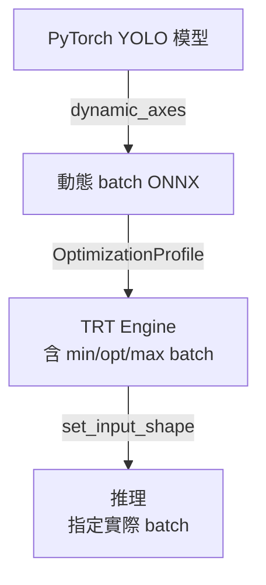
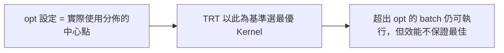

# 動態 Batch 工作流程

本頁說明如何讓 YOLO ONNX 模型支援動態 batch 大小，在 TensorRT 推理時可以靈活指定每次輸入的圖片數量。

## 整體流程



## Step 1 — 匯出動態 Batch ONNX

```python
import torch

model = ...  # 你的 YOLO model
model.eval()

dummy = torch.zeros(1, 3, 640, 640)

torch.onnx.export(
    model,
    dummy,
    "yolo.onnx",
    opset_version=17,
    input_names=["images"],
    output_names=["output0"],
    dynamic_axes={
        "images":  {0: "batch"},   # batch dim 動態
        "output0": {0: "batch"},   # 輸出也要設！
    }
)
```

> **常見錯誤**：只設輸入的 `dynamic_axes`，忘記設輸出 `output0`，導致輸出 batch 維度固定為 1。

驗證 ONNX：

```python
import onnx
model_onnx = onnx.load("yolo.onnx")
onnx.checker.check_model(model_onnx)
print("ONNX OK")
```

## Step 2 — 建構 TRT Engine（含 OptimizationProfile）

### 方式一：trtexec（推薦）

```bash
trtexec \
  --onnx=yolo.onnx \
  --saveEngine=yolo.engine \
  --fp16 \
  --minShapes=images:1x3x640x640 \
  --optShapes=images:4x3x640x640 \
  --maxShapes=images:16x3x640x640
```

### 方式二：Python API

```python
import tensorrt as trt

TRT_LOGGER = trt.Logger(trt.Logger.WARNING)

def build_engine(onnx_path, engine_path, fp16=True,
                 min_batch=1, opt_batch=4, max_batch=16):
    builder = trt.Builder(TRT_LOGGER)
    network = builder.create_network(
        1 << int(trt.NetworkDefinitionCreationFlag.EXPLICIT_BATCH)
    )
    parser = trt.OnnxParser(network, TRT_LOGGER)

    with open(onnx_path, "rb") as f:
        if not parser.parse(f.read()):
            for i in range(parser.num_errors):
                print(parser.get_error(i))
            raise RuntimeError("ONNX parse failed")

    config = builder.create_builder_config()
    if fp16:
        config.set_flag(trt.BuilderFlag.FP16)

    # ★ 動態 Batch 的關鍵：OptimizationProfile
    profile = builder.create_optimization_profile()
    profile.set_shape(
        "images",
        min=(min_batch, 3, 640, 640),
        opt=(opt_batch, 3, 640, 640),
        max=(max_batch, 3, 640, 640),
    )
    config.add_optimization_profile(profile)

    serialized = builder.build_serialized_network(network, config)
    with open(engine_path, "wb") as f:
        f.write(serialized)

build_engine("yolo.onnx", "yolo.engine")
```

> TRT 7+ 必須加 `EXPLICIT_BATCH` flag，否則 build 會失敗。

## Step 3 — 推理（動態指定實際 Batch）

```python
import tensorrt as trt
import numpy as np
import pycuda.driver as cuda
import pycuda.autoinit

def load_engine(engine_path):
    runtime = trt.Runtime(trt.Logger(trt.Logger.WARNING))
    with open(engine_path, "rb") as f:
        return runtime.deserialize_cuda_engine(f.read())

engine  = load_engine("yolo.engine")
context = engine.create_execution_context()

def infer(imgs: np.ndarray):
    batch = imgs.shape[0]

    # ★ 每次推理前設定實際 batch size
    context.set_input_shape("images", (batch, 3, 640, 640))

    d_input  = cuda.mem_alloc(imgs.nbytes)
    out_shape = (batch, 8400, 85)   # 依 YOLO 版本調整
    output   = np.empty(out_shape, dtype=np.float32)
    d_output = cuda.mem_alloc(output.nbytes)
    stream   = cuda.Stream()

    cuda.memcpy_htod_async(d_input, imgs, stream)
    context.execute_async_v3(stream.handle)
    cuda.memcpy_dtoh_async(output, d_output, stream)
    stream.synchronize()
    return output

imgs   = np.random.rand(4, 3, 640, 640).astype(np.float32)
result = infer(imgs)
print(result.shape)  # (4, 8400, 85)
```

## OptimizationProfile 的 opt 設定原則



| 場景 | opt 建議 |
|------|---------|
| 90% 請求是 batch=1 | opt=1 |
| 主要是 batch=4~8 | opt=4 或 6 |
| 均勻分佈 | opt 填中間值 |

opt 填錯（例如填 max）會導致小 batch 時效能偏差。

## 常見問題

| 問題 | 原因 | 解法 |
|------|------|------|
| Build 時報錯 EXPLICIT_BATCH | TRT 7+ 必須設定 | 加 `1 << int(trt.NetworkDefinitionCreationFlag.EXPLICIT_BATCH)` |
| 推理 batch 超出 max | Profile 外的 shape 報錯 | 確保 max_batch 夠大，或切成多份 |
| 輸出 batch 固定為 1 | dynamic_axes 只設輸入 | output 也要加 `{0: "batch"}` |
| FP16 某層精度不足 | 某層退回 FP32 | 可加 `--precisionConstraints=obey` 強制 |
