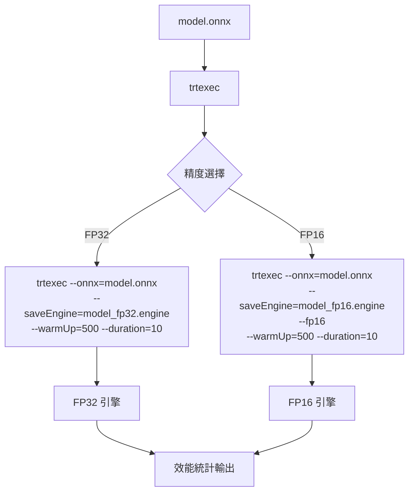

# TensorRT 引擎建置

## 建置流程



## trtexec 輸出解析

`trtexec` stdout 包含效能統計，可用正規表達式提取：

```
[I] Throughput: 1234.56 qps
[I] Latency: min = 0.123 ms, max = 0.456 ms, mean = 0.234 ms
[I]          median = 0.230 ms, percentile(99%) = 0.440 ms
```

## 引擎快取策略

- 引擎序列化為二進位檔，避免每次啟動重複最佳化
- 若引擎已存在則跳過重建，顯著節省啟動時間
- 強制重建：刪除舊引擎檔案後重新執行

## 常見問題

| 問題 | 原因 | 解法 |
|------|------|------|
| 建置極慢 | 首次建置需最佳化核心 | 正常，耐心等待 |
| FP16 精度警告 | 部分層不支援 FP16 | trtexec 自動回退 FP32，可忽略 |
| 引擎無法載入 | GPU/TRT 版本不符 | 刪除引擎重新建置 |
