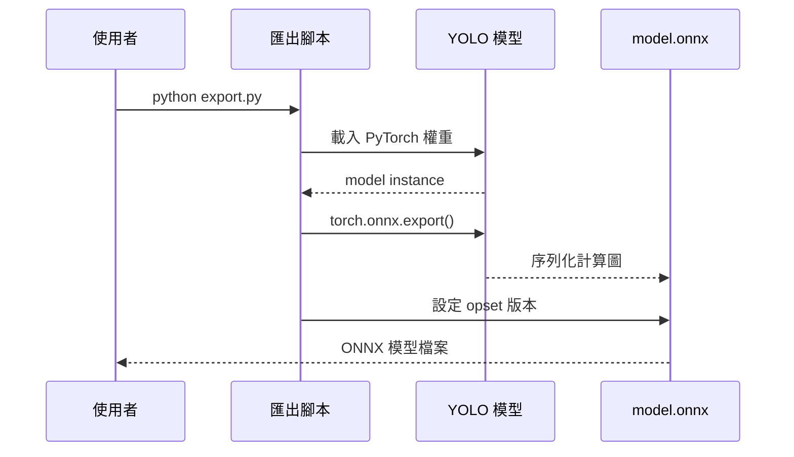

# ONNX 模型匯出

## 匯出流程



## 關鍵設定

| 參數 | 說明 |
|------|------|
| `opset_version` | ONNX 運算子集版本，建議 ≥ 11 |
| `dynamic_axes` | 若需動態 batch 大小則設定 |
| `input_names` | 輸入 tensor 名稱 |
| `output_names` | 輸出 tensor 名稱 |

## 模型驗證

匯出後應從 ONNX 圖自動讀取輸入形狀，確認 `MODEL_H`、`MODEL_W`、`MODEL_C` 正確：

```python
import onnx
model = onnx.load("model.onnx")
input_shape = model.graph.input[0].type.tensor_type.shape
```

這能確保後續前處理的 resize 目標尺寸與模型實際輸入一致。
