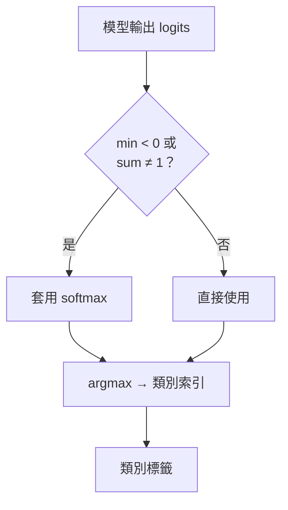

# 前處理管線

## 管線步驟

## 關鍵特性

| 特性 | 設定 | 說明 |
|------|------|------|
| 縮放方式 | 直接 resize | **無 letterbox**，可能有形變 |
| 正規化 | ÷ 255 | 像素值映射到 [0, 1] |
| 通道順序 | RGB | 與 PyTorch 訓練一致 |
| 格式 | NCHW | TensorRT 標準輸入格式 |

## 輸出後處理

## 多後端前處理對齊

準確率比對的前提是各後端使用**完全相同**的前處理邏輯：resize 方式、正規化係數、通道順序必須與訓練時保持一致。任何差異都會導致輸出不一致，使準確率下降。
